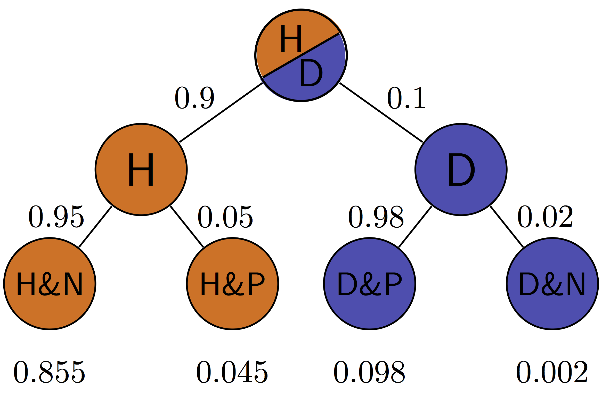
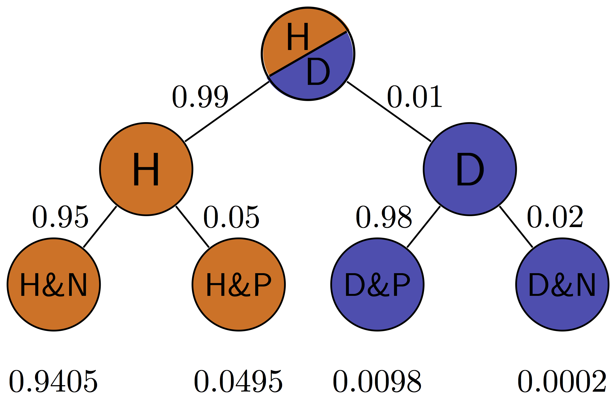
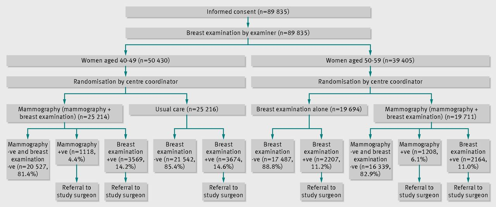
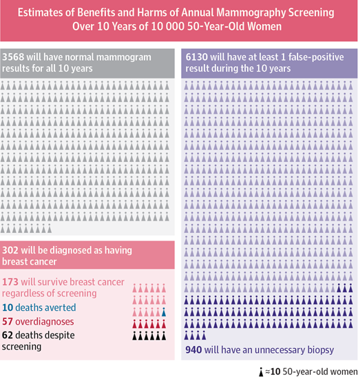

# Prior knowledge and Bayesian thinking {#sec-bayes}

> Man can believe the impossible, but man can never believe the improbable.\
> -- Oscar Wilde, *The Decay of Lying*

In the last few chapters we defined the notion of independence and learned how to perform a statistical test to determine how likely a data set of two categorical variables is to have come from two independent random variables. This approach comes from the toolbox of classical "frequentist" statistics, which is taught in every statistics textbook in the world. It reduces statistical inference to a binary choice: reject or not reject the null hypothesis, based on the magic number called the p-value. However, this approach has deep problems, especially when applied mechanically and without understanding its limitations. Perhaps the most important limitation is that p-value based hypothesis testing does not incorporate any knowledge into its decision-making, aside from the given data. This may be reasonable at an early, exploratory stage of an experiment, but usually one has some prior knowledge about the likelihood of the hypothesis being tested. This knowledge cannot influence the data and the calculation of the p-value, of course, but it can have a dramatic effect on the interpretation, or inference one draws from the test. In this chapter you will learn to do the following:

-   explain the effect or prior knowledge on interpretation of an experimental result
-   calculate post-test probability based on prior probability, test result, and conditional probabilities of the test being in error
-   use conditional statements to simulate random decisions with a given probability
-   explain why conclusions based on binary p-value testing are frequently wrong

## Prior knowledge

\label{sec:model7}

Suppose that a patient walks into a doctor's office, the doctor orders a pregnancy test, and the results indicate that the patient is pregnant. The doctor consults the published sensitivity and specificity values (that we defined in the last chapter) to discover, for instance, that 99% of positive pregnancy tests are correct. The doctor goes back to congratulate the patient with impending motherhood. Sound very reasonable, doesn't it? Would it still sound reasonable if the doctor knew that the patient does not have a uterus (whatever their gender may be)?

This is a slightly absurd example, of course, but it neatly illustrates the central point of this chapter: prior knowledge has an effect on the inference from a test, no matter how small or large the p-value and the power of the test. For a patient with no uterus, their *prior probability* of being pregnant is 0, and that is not changed by a test, no matter how accurate (of course, no test is 100% accurate). In this case, the positive pregnancy test must have been a false positive, even though it's unlikely, since the other possibility - that of a true positive - is impossible.

We all consider prior knowledge before coming to a conclusion. For instance, the credibility of a statement from a person very much depends on past performance: if the person is a habitual liar, you probably wouldn't put much stock in his or her words. On the other hand, if a person is known to be trustworthy, you might take their statement seriously even if it surprising. If your significant other has always been transparent and honest, even if you discover a suspiciously sexy message from someone else on his/her phone, you will listen to their explanation and consider alternative explanations, in other words, that this was a false positive. If they had abused your trust in the past, it's much more likely that this sexy text is actual evidence of cheating, and maybe it's time to cut them loose!

In the context of science, the accumulation of knowledge is the basis of building scientific theories. Nothing in science is ever proven, unlike in mathematics, instead different statements have different degrees of certainty based on past experience. A theory that has been tested for years, is considered to have a very high likelihood and may even be called a Law of nature, like Newton's laws in physics. If experimental data came along that challenged Newton's Law of gravitational attraction (as Einstein's relativity did) scientists would rightfully treat it much more skeptically than an experiment that agrees with prior experience. Carl Sagan summarized the effect of prior knowledge of evaluating evidence with the pithy phrase "extraordinary claims require extraordinary evidence" - that is, a claim that is highly unlikely based on past knowledge must be backed up by very strong data.

{#fig-xkcd-bayes}

The perils of ignoring prior knowledge is illustrated in the xkcd cartoon shown in @fig-xkcd-bayes. In this case, the "solar detector" lies (makes an error) with probability 1/36, so when it tells you that the sun exploded, it has only 1/36 probability that it made a false positive error. However, based on our prior knowledge, the sun is extremely unlikely to blow up or disappear, so the alternative that the sun exploded and the detector is correct is even less likely. Although the cartoon portrays this as a disagreement between frequentists and Bayesians, it is more properly understood as a disagreement between mindless application of frequentist thought and everyone else.

## Bayes' formula

\label{sec:math7}

In this section we will formalize the process of incorporation of prior knowledge into probabilistic inference by going back to the notion of conditional probability in @sec-cond-prob. First, if you multiply both sides of the definition by $P(B)$, then we obtain the probability of the intersection of events $A$ and $B$: $$P(A \land B) = P(A|B) P(B); \;  P(A \land B) = P(B|A) P(A) $$ Second, we can partition a sample space into two complementary sets, $A$ and $-A$, and then the set of $B$ can be partitioned into two parts, that intersect with $A$ and $-A$, respectively, so that the probability of $B$ is $$P(B) = P(A \land B) + P(-A\land B)$$

The two formulas together lead to a very important result called the *law of total probability* $$P(B) =  P(B|A) P(A) + P(B|-A)P(-A)$$

It may not be clear at first glance why this is useful: after all, we replaced something simple ($P(B)$) with something much more complex on the right hand side. You will see how this formula enables us to calculate quantities that are not otherwise accessible.

**Example: probability of a negative test result**. Suppose we know that the probability of a patient having a disease is 1% (called the *prevalence* of the disease in a population), and the sensitivity and specificity of the test are both 80%. What is the probability of obtaining a negative test result for a randomly selected patient? Let us call $P(H) = 0.99$ the probability of a healthy patient and $P(D) = 0.01$ the probability of a diseased patient. Then:

$$ P(Neg) =  P(Neg | H) P(H) + P(Neg | D)P(D)  = $$ $$ = 0.8 \times 0.99 + 0.2 \times 0.01 = 0.794$$

There is still more gold in the hills of conditional probability! Take the first formula in this section, which expresses the probability $P(A \land B)$ in two different ways. Since the expressions are equal, we can combine them into one equation, and by dividing both sides by $P(B)$, we obtain what's known as Bayes' formula: $$ P(A|B) = \frac{P(B|A) P(A)}{P(B) }$$

We can rewrite the denominator in Bayes' using the Law of total probability so that it can calculated from conditional probabilities:

$$P(A|B) = \frac{P(B|A)P(A)}{P(B|A) P(A) + P(B|-A)P(-A)}$$

Bayes' formula gives us the probability of $A$ given $B$ from probabilities of $B$ given $A$ and given $-A$, and the prior (baseline) probability of $P(A)$. This is enormously useful when it is easy to calculate the conditionals one way and not the other. Among its many applications, it computes the effect of a test result with given sensitivity and specificity (conditional probabilities) on the probability of the hypothesis being true.

### positive and negative predictive values

In reality, a doctor doesn't have the true information about the patient's health, but rather the information from the test and hopefully some information about the population where she is working. Let us assume we know the rate of false positives $P(Pos | H$) and the rate of false negatives $P(Neg | D)$, as well as the prevalence of the disease in the whole population $P(D)$. Then we can use Bayes' formula to answer the practical question, if the test result is positive, what is the probability the patient is actually sick? This is called the *positive predictive value* of a test. The deep Bayesian fact is that one cannot make inferences about the health of the patient after the test without some *prior knowledge*, specifically the prevalence of the disease in the population:

$$ P(D | Pos) =  \frac{P(Pos|D)P(D)}{P(Pos|D) P(D) + P(Pos | H)P(H)}$$

**Example.** Suppose the test has a 0.01 probability of both false positive and false negatives, and the overall prevalence of the disease in the population 0.02. You may be surprised that from an epidemiological perspective, a positive result is far from definitive:

$$ P(D | Pos)  = \frac{0.99 \times 0.02}{0.99 \times 0.02 + 0.01 \times 0.98} = 0.67 $$

This is because the disease is so rare, that even though the test is quite accurate, there are going to be a lot of false positives (about 1/3 of the time) since 98% of the patients are healthy.

We can also calculate the probability of a patient who tests negative of actually being healthy, which is called the negative predictive value. In this example, it is far more definitive:

$$ P(H | Neg)  = \frac{P(Neg|H)P(H)}{P(Neg|H) P(H) + P(Neg | D)P(D)} = $$ $$ = \frac{0.99 \times 0.98}{0.99 \times 0.98 + 0.01 \times 0.02} =  0.9998$$

This is again because this disease is quite rare in this population, so a negative test result is almost guaranteed to be correct. In another population, where disease is more prevalent, this may not be the case.

@fig-test-tree illustrates all of the possibilities of a binary medical test: positive (P) or negative (N) for a patient who is either healthy (H) or diseased (D). The four outcomes correspond to the four outcomes of tests we saw in @sec-hyp-test-errors: true positives are D&P, false positives are H&P, true negatives are H&N and false negatives are D&N. This allows us to calculate the positive predictive value, which is the probability that a positive result is correct. For the patient with disease prevalence of 0.1, $PPV = TP/(TP+FP) = 0.098/(0.098+0.045) \approx 0.685$. For the patient with disease prevalence of 0.01, $PPV = TP/(TP+FP) = 0.0098/(0.0098+0.0495) \approx 0.165$. The exact same test has a higher PPV for a patient who has a higher prior probability of having a disease.

The negative predictive value can be calculated in a similar manner for the patient with disease prevalence of 0.1: $NPV = TN/(TN+FN) = 0.855/(0.855+0.002) \approx 0.998$. For the patient with disease prevalence of 0.01, $NPV = TN/(TN+FN) = 0.9405/(0.9405+0.0002) \approx 0.9998$. The exact same test has a higher NPV for a patient who has a lower prior probability of having a disease.

::: {#fig-test-tree layout-ncol="2"}




Probabilities of the four possible outcomes for patients with different disease prevalence using the same medical test with sensitivity (rate of true positives) of 0.98 and specificity (rate of true negatives) of 0.95.
:::

### Exercises

The table below shows the results of using X-ray imaging as a diagnostic test for tuberculosis in patients with known TB status. Use it to answer the questions below.

| Test for TB | TB absent | TB present |
|-------------|-----------|------------|
| Negative    | 1739      | 8          |
| Positive    | 51        | 22         |

Use this table to calculate the sensitivity and specificity of the test. Suppose that you have the knowledge that the prevalence of TB in a population is P(D) = 0.001, use the previously calculated sensitivity and specificity to answer the following questions about testing a patient from the population (not those used in the study in the table.)

1.  Using the law of total probability, calculate P(Pos), the probability that a randomly chosen person from the population tests positive for the disease and P(Neg), the probability that a randomly chosen person tests negative for the disease.

2.  Using Bayes' formula, find the probability that a patient who tested positive has the disease $P(D | Pos)$ and the probability that a patient who tested negative is healthy $P(H | Neg)$.

3.  If the disease prevalence were $P(D) = 0.5$, repeat the calculations to find the new $P(D | Pos)$ and $P(H | Neg)$.

Dating apps allow us to look a person's profile (or picture) and decide whether we'd like to date them (swipe right) or not (swipe left). Let us treat this like a hypothesis test, with the null hypothesis being that you don't want to date an individual. Then the swipe right decision is a positive result (rejecting the null) and the swipe left decision is a negative result (not rejecting the null).

Suppose you think you're pretty good at deciding who you want to date, and you think that your sensitivity is 80% and your specificity is 66%.

4.  If you go through the profiles of 200 people in a population where you expect 25% of the population to be dateable, how many times can you expect to swipe right? Hint: multiply the probability by the number of people to find out the expected number of swipes.

5.  If instead the population had only 5% dateable individuals, how many times can you expect to swipe right?

6.  Suppose you swipe right on a person from the 25% dateable population and go on a date. What's the probability that it's a good one (this is a person you actually want to date)?

7.  Suppose you swipe right on a person from the 5% dateable population and go on a date. What's the probability that it's a good one (this is a person you actually want to date)?

## Applications of Bayesian thinking {#sec-bayes-apps}

The essence of the Bayesian approach to statistics is that everything comes with a prior probability, or odds, as Bayesians like to express it. There is usually some prior knowledge one has to assess the odds that a hypothesis is true before doing an experiment, which is called the prior. If you don't explicitly assume the prior, then you've assumed it implicitly. For example, the naive answer for the positive predictive value that ignores the prior prevalence for a test with 99% specificity and sensitivity is that it is also 99%. This assumes that the patient has equal prior probability of disease and health, as you can verify using Bayes' formula. Even in the absence of any data for a particular population, this is an unlikely assumption for most diseases. So the Bayesian advice is: assign odds to everything to the best of your knowledge so you don't get played for a sucker. An excellent summary of the misuses of p-value and the Bayesian approach to interpretation of medical data, see [@goodman_toward_1999].

### when too much testing is bad

For many decades, doctors recommended early cancer screening in a major public health effort to help reduce the mortality rate from cancer. This makes sense because the prognosis is generally much better for cancer when it is detected early, since the tumor is small and has not yet metastasized. This approach has taken hold in the public imagination in the US, and given us pink-ribbon campaigns aimed at breast cancer awareness and celebrities advising everyone to get tested early and often.

More recently, large-scale studies have shown that that preventative screenings do not necessarily improve the survival rate of cancer patients. One study from Canada [@miller_twenty_2014] assigned almost 90,000 women randomly into two equal-size groups, by a randomization process illustrated in @fig-mamm-screen. One of the groups received yearly mammography screenings for 5 years and one did not. The women were between the ages of 40 and 59, and then study then tracked the participants for 25 years to see whether there was a difference in cancer mortality rates between the two groups.

{#fig-mamm-scree}

The results may be surprising: the mortality rates were very similar, and in fact, slightly more women died of breast cancer in the mammography group than in the control group (180 vs 171). At the same time, more cases of invasive breast cancers were diagnosed in the mammography group, which may mean either that early treatment did not make a difference or that many of those cases were false positives.

This may seem counterintuitive: isn't more information, however imperfect, better? Viewed from a Bayesian perspective, the results should be less than surprising. Since the prior probability of developing breast cancer in any given year is small, the positive predictive value of the test is likely low, and most of the positive results end up being false positives. A false positive result for breast cancer has a major negative impact on a person's life: it means more invasive testing, a lot of worrying, and sometimes unnecessary treatment with serious side effects. This does not mean, of course, that cancer screening is never useful, and I am not trying to offer medical advice. For patient populations with a higher prior probability such screening tests may in fact provide a substantial benefit. But this once again underscores the importance of taking into account prior knowledge. @fig-mamm-ill

{#fig-mamm-ill}

### reliability of scientific studies

In 2005 John Ioannidis published a paper entitled "Why most published research findings are wrong" [@ioannidis_why_2005]. The paper, as you can see by its title, was intended to be provocative, but it is based solidly on the classic formula of Bayes. The motivation for the paper came from the observation that too often in modern science, big, splashy studies that were published could not be reproduced or verified by other researchers. What could be behind this epidemic of questionable scientific work?

![The dependence of post-study probability (positive predictive value) on the pre-study odds, for different power of the study, and with different levels of bias [@ioannidis_why_2005]](ch7/ioannidis_bayes.png){#fig-ioannidis-bayes}

The problem as described by Ioannidis and many others, in a nutshell, is that unthinking use of traditional hypothesis testing leads to a high probability of false positive results being published. The paper outlines several ways in which this can occur.

First, there is the problem of prior knowledge. Too often, a hypothesis is tested and if the resultant p-value is less than some arbitrary threshold (very often 0.05), then the results are published. However, if one is testing a hypothesis with low prior probability, a positive hypothesis test result is very likely a false positive. Very often, modern biomedical research involves digging through a large amount of information, like an entire human genome, in search for associations between different genes and a phenotype, like a disease. It is *a priori* unlikely that any specific gene is linked to a given phenotype, because most genes have very specific functions, and are expressed quite selectively, only at specific times or in specific types of cells. However, publishing such studies results in splashy headlines (e.g. "Scientists find a gene linked to autism!") and so a lot of false positive results are reported, only to be refuted later, in much less publicized studies.

The second problem compounds the first one: multiple research groups studying the same phenomenon. This should be a good thing, but it can lead to a higher volume of false positive results. Suppose that 20 groups are all testing the same hypothesis, and are using the same p-value cutoff of 0.05 to decide whether their results is "significant". Even if their null hypothesis is true, and there is no effect, 1 out 20 groups is likely to obtain a p-value less than 0.05, simply by random variation. What do you think that group will do? Yes, they should compare its results with the other groups, or try to repeat the experiment multiple times. But repeating experiments is costly and boring, and telling your competitors about your results can lead to your getting scooped. Better publish fast!

The third problem is even more insidious: bias in the experimental work, either conscious or non. Some of it may be due to experimental design, like biased sampling, or defective instrumentation - no experiment is perfect. One big violation of good experimental design is known as p-value fishing: repeating the experiment, or increasing the sample size, until the p-value is below the desired threshold, and then stopping the experiment. Using such defective design dramatically lowers the likelihood that the result is a true positive. And of course there is actual fraud, or fudging of data, which contributes to some bogus results.

Ioannidis performed basic calculations of the probability that a published study is true (that is, that a positive reported result is a true positive), and how it is affected by pre-study (prior) probability, number of conducted studies on the same hypothesis, and the level of bias. His prediction is that for fairly typical scenario (e.g. pre-study probability of 10%, ten groups working simultaneously, and a reasonable amount of bias) the probability that a published result is correct is less than 50%. This effect is shown in @fig-ioannidis-bayes, taken from his paper. He then followed up with another paper [@ioannidis_ja_contradicted_2005] that investigated 49 top-cited medical research publications over a decade, and looked at whether follow-up studies could replicate the results, and found that a very significant fraction of their findings could not be replicated by subsequent investigations.

This might leave you with a rather bleak view of scientific research. Indeed, many in the community have been sounding the alarm about the lack of replicability of published results, and have proposed some basic remedies. Perhaps the most important is the issue that only positive results are deemed worthy of publication. If all of the 20 groups in the scenario above published their results, 19 would report no effect, and 1 would report an effect, and the picture would be clear. There are some journals (e.g. PLoS One) which accept any methodologically sound submission, regardless of whether the result is positive or negative. Another remedy is to provide funding for research labs to repeat other groups' studies to test them. These steps are being implemented, and hopefully will eventually lead to an improvement in the reliability of published data. Even more importantly, educating scientists about basic probability ideas, such as Bayes' formula and the notion of prior knowledge, should improve the quality of inference and decrease the amount of questionable science.

### discussion questions

The following questions refer to the paper "Why most published research findings are wrong" [@ioannidis_why_2005].

1.  What are some of the examples of studies with low prior odds that Ioannidis uses as examples?

2.  Due to human imperfection, there will always be some bias in conducting and reporting scientific results. What do you expect to be the typical level of bias (u in the paper)?

3.  What does Ioannidis propose to remedy the problem of lack of reproducibility of studies? Will you take them into account when reading scientific publications or doing your own research?

## Multiple hypothesis testing and p-value corrections

Many times in science, one has to perform hypothesis tests on separate, independent questions; e.g. test 20 patients for a disease. This can lead to higher probability of errors in the aggregate: if we test 20 healthy patients using a test with a false positive rate of 0.05 (like using a significance level of 0.05), then the **probability of at least one of the tests being a false positive** is much higher than 0.05, as can be calculated from the binomial distribution:

$$P(k>0; p=0.05, n=20) = 1 - P(k=0; p=0.05, n=20) = 1-0.95^{20} \approx 0.64$$

This is a particular problem in several situations, for example when multiple groups perform similar studies, but only the ones that return a positive result are published (see our discussion about publication bias in the last chapter). It is also a problem when there are multiple associations between different variables tested in the same study. If one applies a significance level of 0.05 or 0.01, one may end reporting a lot of false positive results (depending on the number of different hypotheses tested). What can be done about it?

### Bonferroni correction

The simplest approach is called the Bonferroni correction. The method is straightforward: if you perform $n$ independent test and want to control the probability of making at least one false positive error, then you need to reduce the significance level by the factor of $n$; $\alpha_B = \alpha /n$. The result of this adjustment is to make sure the probability of making at least one error out of $n$ tests (what is known as the "Family-wise error rate") is equal to the significance level $\alpha$. If you want to be pedantic, it's only approximately true: for example, in the case of the scenario described above, the probability of at least one error with the Bonferroni correction will be

$$P(k>0)=1−P(k=0;p=0.05/20,n=20)=1−(1-0.05/20)^{20} ≈ 0.0488$$

The Bonferroni correction is a blunt instrument: it dramatically reduced the number of false positives, but it also makes real effect difficult to detect. For that reason it is considered a *conservative* method for multiple hypothesis testing, and more sophisticated methods are often preferred.

### FDR correction

A more effective approach aims to control the *False Discovery Rate* (FDR) instead of the Family-wise error rate. The FDR is defined as the complement of the PPV, that is the fraction of false positives out of all positive results. Essentially, instead of trying to avoid even a single false positive, let's control the fraction of false positive results.

One of the best methods is called the Benjamini-Hochberg method, which is far more complicated than Bonferroni. The procedure follows the following steps, given n p-values and a chosen FDR level q (e.g. 0.05):

1.  Sort the p-values in ascending order: $p_1 ≤ p_2 ≤ … ≤ p_n$ keeping track of which hypothesis each belongs to.

2.  For each rank i, compute the BH critical value (i/n)·q.

3.  Find the **largest** rank k for which $p_k ≤ (k/n)·q$.

4.  Reject (declare significant) all hypotheses with rank 1 through k — even any whose own p-value exceeded its individual critical value.

## GWAS simulation

The following simulates the results of a Genome-wide association study, which tests multiple alleles (SNPs) for association with a trait (e.g. height), and this trait is numeric and is normally distributed. This simulator assumes that a certain number of SNPs (which you can control with a slider) are associated with the trait, that is the height of the people with this SNP are different than for those without it. The mean difference in the height distributions for a SNP with an effect is set by another slider, measured in terms of standard deviations of the trait. You can also control the sample size, that is the number of people in the study.

The result of a GWAS is a number of independent hypothesis tests (one for each SNP) which all return a p-value. Then a researcher has to decide on the appropriate significance threshold (e.g. 0.01 or 0.05), below which the hypothesis is rejected. The simulator allows you to choose between three significance levels, as well as to apply one of two kinds of p-value adjustment: the Bonferroni correction or the FDR (Benjamini-Hochberg) correction.

```{shinylive-r}
#| standalone: true
#| viewerHeight: 650

library(shiny)
library(bslib)
library(ggplot2)

# =============================================================================
# Simulated genome-wide association study (GWAS)
#
# Sliders set the number of SNPs, how many are truly associated (causal), the
# per-allele effect size, and the sample size. Each SNP's association test
# statistic is simulated directly from its non-centrality rather than by fitting
# a regression, which keeps it fast for tens of thousands of SNPs:
#
#   * null SNP:    z ~ N(0, 1)
#   * causal SNP:  z ~ N(mu, 1),   mu = beta * sqrt(N * 2*MAF*(1-MAF))
#
# so power grows with effect size, sample size and allele frequency exactly as
# in a real study. p = P(chi^2_1 > z^2). A multiple-testing correction
# (none / Bonferroni / Benjamini-Hochberg FDR) is applied and the corresponding
# significance threshold is drawn on the Manhattan plot. Causal SNPs are
# coloured so true positives, missed causal SNPs and false positives are all
# visible.
#
# To run:
#   install.packages(c("shiny", "ggplot2"))
#   shiny::runApp("gwas_sim_app.R")
# =============================================================================


M_MAX <- 50000L
# Approximate human autosome sizes (Mb), chromosomes 1..22, for laying out x.
CHR_SIZES <- c(249, 243, 198, 191, 181, 171, 159, 145, 138, 134, 135,
               133, 114, 107, 102, 90, 83, 80, 59, 64, 47, 51)

# ---- A fixed "genome": stable random pieces generated once -------------------
make_genome <- function(M_max = M_MAX, seed = 42) {
  set.seed(seed)
  list(
    z0  = rnorm(M_max),                       # null noise, per SNP
    maf = runif(M_max, 0.05, 0.50),           # minor allele frequency
    sgn = sample(c(-1, 1), M_max, TRUE)       # direction of effect
  )
}

# Deterministic genomic layout for the first M SNPs (no randomness, so stable).
layout_snps <- function(M) {
  total <- sum(CHR_SIZES)
  u     <- ((seq_len(M) - 0.5) / M)           # evenly spread across the genome
  gpos  <- u * total                          # cumulative position (Mb)
  chr   <- findInterval(gpos, cumsum(CHR_SIZES)) + 1L
  chr   <- pmin(chr, length(CHR_SIZES))
  list(gpos = gpos, chr = chr)
}

# ---- Run one simulation ----------------------------------------------------
simulate_gwas <- function(genome, M, m_causal, beta, N, alpha, method) {
  idx <- seq_len(M)
  z0  <- genome$z0[idx]; maf <- genome$maf[idx]; sgn <- genome$sgn[idx]
  lay <- layout_snps(M)

  causal <- logical(M)
  if (m_causal > 0) {
    ci <- unique(round(seq(1, M, length.out = m_causal)))
    causal[ci] <- TRUE
  }

  # Non-centrality shift for causal SNPs; observed z = noise + shift
  ncp <- beta * sqrt(N * 2 * maf * (1 - maf))
  z   <- z0
  z[causal] <- z0[causal] + sgn[causal] * ncp[causal]

  p    <- pchisq(z^2, df = 1, lower.tail = FALSE)
  padj <- p.adjust(p, method = method)
  sig  <- padj < alpha

  # Every method reduces to a single raw-p threshold on the Manhattan plot
  thr_p <- switch(method,
    none       = alpha,
    bonferroni = alpha / M,
    BH         = if (any(sig)) max(p[sig]) else NA_real_
  )

  df <- data.frame(
    gpos = lay$gpos, chr = lay$chr,
    p = p, logp = pmin(-log10(p), 40),   # cap for display
    causal = causal, sig = sig
  )

  attr(df, "summary") <- list(
    M = M, m_causal = sum(causal), n_sig = sum(sig),
    TP = sum(sig & causal), FP = sum(sig & !causal),
    FN = sum(!sig & causal),
    power = if (sum(causal) > 0) sum(sig & causal) / sum(causal) else NA_real_,
    fdr   = if (sum(sig) > 0) sum(sig & !causal) / sum(sig) else NA_real_,
    thr_p = thr_p, method = method, alpha = alpha
  )
  df
}

# ---- Manhattan plot --------------------------------------------------------
COLS <- c(null_odd = "#c3c7cc", null_even = "#9aa0a6",
          FP = "#d62728", FN = "#ff7f0e", TP = "#2ca02c")

manhattan_plot <- function(df) {
  s <- attr(df, "summary")

  cat <- ifelse(df$chr %% 2 == 1, "null_odd", "null_even")
  cat[df$causal & df$sig]   <- "TP"
  cat[df$causal & !df$sig]  <- "FN"
  cat[!df$causal & df$sig]  <- "FP"
  df$cat <- factor(cat, levels = names(COLS))

  bounds <- c(0, cumsum(CHR_SIZES))
  mids   <- (head(bounds, -1) + tail(bounds, -1)) / 2

  is_null <- df$cat %in% c("null_odd", "null_even")
  gw_line <- -log10(5e-8)                       # conventional GWAS threshold
  thr_line <- if (is.finite(s$thr_p)) -log10(s$thr_p) else NA

  p <- ggplot() +
    geom_point(data = df[is_null, ],
               aes(gpos, logp, colour = cat), size = 0.55, alpha = 0.75) +
    geom_point(data = df[df$cat == "FP", ],
               aes(gpos, logp, colour = cat), size = 1.7) +
    geom_point(data = df[df$cat == "FN", ],
               aes(gpos, logp, colour = cat), size = 1.9) +
    geom_point(data = df[df$cat == "TP", ],
               aes(gpos, logp, colour = cat), size = 2.1) +
    geom_hline(yintercept = gw_line, linetype = "dotted", colour = "grey55") +
    annotate("text", x = 0, y = gw_line, vjust = -0.5, hjust = 0,
             size = 3, colour = "grey45", label = "genome-wide 5e-8") +
    scale_colour_manual(
      values = COLS, drop = FALSE, name = NULL,
      breaks = c("TP", "FN", "FP"),
      labels = c("True positive (causal, detected)",
                 "False negative (causal, missed)",
                 "False positive (null, detected)")) +
    scale_x_continuous(breaks = mids, labels = seq_along(CHR_SIZES),
                       expand = expansion(mult = 0.01)) +
    labs(x = "Chromosome", y = expression(-log[10](italic(p)))) +
    guides(colour = guide_legend(override.aes = list(size = 3))) +
    theme_bw(base_size = 13) +
    theme(panel.grid.minor = element_blank(),
          panel.grid.major.x = element_blank(),
          legend.position = "bottom")

  if (is.finite(thr_line)) {
    lab <- paste0(switch(s$method, none = "uncorrected",
                         bonferroni = "Bonferroni", BH = "BH-FDR"),
                  " threshold")
    p <- p +
      geom_hline(yintercept = thr_line, linetype = "solid",
                 colour = "#1a1a1a", linewidth = 0.6) +
      annotate("text", x = max(df$gpos), y = thr_line, vjust = -0.5,
               hjust = 1, size = 3.2, colour = "#1a1a1a", label = lab)
  }
  p
}

# ---- UI --------------------------------------------------------------------
ui <- fluidPage(
  tags$head(tags$style(HTML("
    body { font-family: 'Segoe UI', Roboto, Helvetica, Arial, sans-serif; }
    .metric-card { border:1px solid #e3e3e3; border-radius:10px;
      padding:10px 14px; margin-bottom:10px; background:#fafafa; }
    .metric-label { font-size:12px; color:#666; text-transform:uppercase;
      letter-spacing:.03em; }
    .metric-value { font-size:22px; font-weight:600; color:#1a1a1a; }
    .metric-sub { font-size:12px; color:#555; }
  "))),

  titlePanel("Simulated GWAS: power, false positives, and multiple-testing correction"),

  sidebarLayout(
    sidebarPanel(
      width = 3,
      sliderInput("M", "Number of SNPs tested",
                  min = 5000, max = M_MAX, value = 20000, step = 5000),
      sliderInput("mc", "Number of truly associated (causal) SNPs",
                  min = 0, max = 300, value = 25, step = 1),
      sliderInput("beta", "Per-allele effect size (SD units)",
                  min = 0, max = 0.20, value = 0.10, step = 0.005),
      sliderInput("N", "Sample size",
                  min = 500, max = 50000, value = 8000, step = 500),
      tags$hr(),
      radioButtons("method", "Multiple-testing correction",
                   choices = c("None (raw p)" = "none",
                               "Bonferroni" = "bonferroni",
                               "Benjamini-Hochberg (FDR)" = "BH"),
                   selected = "bonferroni"),
      selectInput("alpha", "Significance level (alpha)",
                  choices = c("0.01" = 0.01, "0.05" = 0.05, "0.10" = 0.10),
                  selected = 0.05),
      helpText("Coloured points are causal SNPs (green = detected, orange = ",
               "missed). Red points are null SNPs that reached significance ",
               "(false positives). The solid line is the chosen threshold; ",
               "the dotted line is the conventional 5e-8.")
    ),

    mainPanel(
      width = 9,
      fluidRow(
        column(3, uiOutput("powerCard")),
        column(3, uiOutput("fdrCard")),
        column(3, uiOutput("countsCard")),
        column(3, uiOutput("thrCard"))
      ),
      plotOutput("manhattan", height = "460px")
    )
  )
)

# ---- Server ----------------------------------------------------------------
server <- function(input, output, session) {

  genome <- reactive(make_genome())          # generated once, cached

  sim <- reactive({
    simulate_gwas(genome(), input$M, input$mc, input$beta, input$N,
                  as.numeric(input$alpha), input$method)
  })

  card <- function(label, value, sub) {
    div(class = "metric-card",
        div(class = "metric-label", label),
        div(class = "metric-value", value),
        div(class = "metric-sub", sub))
  }
  pct <- function(x) if (is.na(x)) "n/a" else sprintf("%.0f%%", 100 * x)

  output$powerCard <- renderUI({
    s <- attr(sim(), "summary")
    card("Power (sensitivity)", pct(s$power),
         sprintf("%d of %d causal detected", s$TP, s$m_causal))
  })
  output$fdrCard <- renderUI({
    s <- attr(sim(), "summary")
    card("Observed false-discovery", pct(s$fdr),
         sprintf("%d of %d hits are false", s$FP, s$n_sig))
  })
  output$countsCard <- renderUI({
    s <- attr(sim(), "summary")
    card("Discoveries", format(s$n_sig, big.mark = ","),
         sprintf("TP %d | FP %d | FN %d", s$TP, s$FP, s$FN))
  })
  output$thrCard <- renderUI({
    s <- attr(sim(), "summary")
    val <- if (is.finite(s$thr_p)) formatC(s$thr_p, format = "e", digits = 1) else "none"
    card("Significance threshold (p)", val,
         sprintf("alpha = %s, %s SNPs", s$alpha, format(s$M, big.mark = ",")))
  })

  output$manhattan <- renderPlot(manhattan_plot(sim()))
}

shinyApp(ui, server)

```

## Questions

1.  Set the number of SNPs to 20,000 and the number of truly associated SNPs to 100, with effect size of 0.06 and the sample size of 8000. Report the power of the test and the FDR for the unadjusted, Bonferroni, and FDR methods.
2.  Keep the same settings, except reduce the effect size to 0.04. Report the power of the test and the FDR for the unadjusted, Bonferroni, and FDR methods.
3.  Keep the same settings, except increase the effect size to 0.08. Report the power of the test and the FDR for the unadjusted, Bonferroni, and FDR methods.
4.  Across different scenarios, what difference do you see between the unadjusted and the Bonferroni corrected results?
5.  Across different scenarios, what difference do you see between the Bonferroni and the FDR-corrected results?
