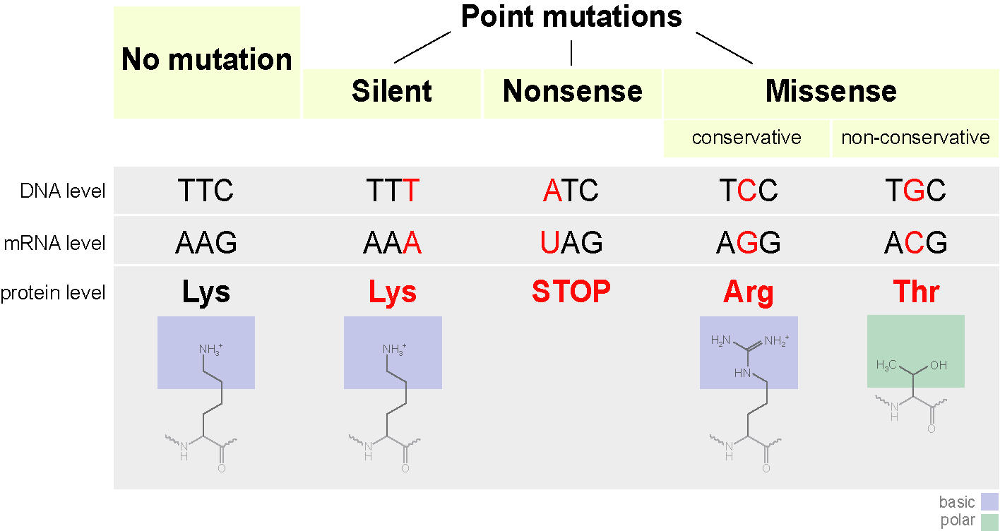

# Describing data sets {#sec-desr-stats}

> Get your facts first, and then you can distort them as much as you please.\
> -- Rudyard Kipling, *An Interview with Mark Twain*

Science begins with experimental measurements, which are then verified by reproducing the results. But no experimental result is perfectly reproducible because all are subject to random noise, whether it is caused by unpredictable processes or is due to measurement error. Describing collections of numbers with noise is the first step to understanding the biological systems that are being measured. In this chapter you will learn to do the following:

-   calculate the means and medians of a data set

-   calculate variances and standard deviations

-   produce histograms and box plots and interpret them

-   connect descriptive stats of data with plots

## Mutations and their rates {#sec-mutations}

All Earth-based lifeforms receive an inheritance from their parent(s): a string of deoxyribonucleic acids (\index{DNA} *DNA*) called the genetic sequence, or \index{genome} *genome* of an individual. The information to produce all the necessary components to build and run the organism is encoded in the sequence of the four different \index{nucleotides} *nucleotides*: adenine, thymine, guanine, and cytosine (abbreviated as A, T, G, C). Different parts of the genome play different roles; some discrete chunks called *genes* contain the instructions to build \index{proteins} *proteins*, the workhorses of biology. To make a protein from a gene, the information is transcribed from DNA into messenger ribonucleic acid (*mRNA*), which is then translated into a string of \index{amino acids} *amino acids* which constitute the protein. The genetic code determines the translation, using three nucleic acids in DNA and RNA to represent a single amino acid in a protein. Thus, a sequence of DNA results in a specific sequence of amino acids, which determine the structure and function of the protein.

{#fig-ch3-mutation width="5in"}

The above processes involve copying and transferring information. As we know from experience, copying information inevitably means introducing errors. This is particularly important when passing information from parent to offspring, because then an entire organism has to develop and live based on a faulty blueprint. Changes introduced in the genome of an organism are called \index{mutation!definition} *mutations*, and they can be caused either by errors in copying DNA when making a new cell (replication) or through damage to DNA through physical means (e.g. ionizing radiation) or chemical mechanisms (e.g. exogenous molecules that react with DNA). The simplest mutation involve a single nucleotide and are called \index{mutation!point} *point mutations*. A nucleotide may be deleted, an extra nucleotide inserted, or a new one substituted instead: the three different types of substitution mutations are shown in @fig-ch3-mutation. Large-scale mutations may involve whole chunks of the genome that are cut out and pasted in a different location, or copied and inserted in another position, but they are typically much more rare than point mutations.

Mutations can have different effects on the mutant organism, although acquisition of super-powers has not been observed. Usually, point mutations have either little observable effect or a negative effect on the health of the mutant. A classic example is \index{sickle-cell disease} *sickle-cell disease*, in which the molecules of the protein hemoglobin, responsible for carrying oxygen in the blood from the lungs to the tissues, tends to stick together and clump, resulting in sickle-shaped red blood cells. The disease is caused by a single substitution mutation in the gene that codes for one of the two components of hemoglobin, called $\beta$-globin. The substitution of a single nucleotide in the DNA sequence (called a *single nucleotide polymorphism* or *SNP*) changes one amino acid in the protein from glutamate to valine, which causes the proteins to aggregate. This \index{mutation!missense} *missense* mutation (see @fig-ch3-mutation) is carried by a fraction of the human population, and those who inherit the allele *allele* from both parents develop the painful and sometimes deadly disease. Such mutations that are present in some but not all of a population are called \index{mutation!polymorphism} *polymorphisms*, to distinguish them from mutations that occurred in evolutionary lineages and differentiate species from each other.

One of the central questions of evolutionary biology is how frequently do mutations occur? Since mutations are generally undesirable, most living things have developed ways to minimize the frequency of errors in copying DNA, and to repair DNA damage. But although mutations are rare, they occur spontaneously in all organisms because molecular processes such as copying a DNA molecule are subject to random noise arising from thermal motion. So mutations are fundamentally a random process and we need to use \index{statistics!descriptive} *descriptive statistics* to analyze data with inherent randomness.

## Describing data sets {#sec-descr-stats}

### central value of a data set

A data set is a collection of measurements. These measurements can come from many kinds of sources, and can represent all sorts of quantities. One big distinction is between numerical and categorical data sets. *Numerical* \index{data!numerical} data sets contain numbers, either integers or real numbers. Some examples: number of individuals in a population, length, blood pressure, concentration. *Categorical* \index{data!categorical} data sets may contain numbers, symbols, or words, limited to a discrete, usually small, number of values. The word categorical is used because this kind of data corresponds to categories or states of the subject of the experiment. Some examples: genomic classification of an individual on the basis of one locus (e.g. wild type or mutant), the state of an ion channel (open or closed), the stage of a cell in the cell cycle.

A data set contains more than one measurement, the number of them is called the size of the data set and is usually denoted by the letter $n$. To describe a data set numerically, one can use numbers called *statistics* (not to be confused with the branch of science of the same name). The most common statistics aim to describe the central value of the data set to represent a typical measurement. If you order all of the measurements from highest to lowest and then take the the middle value, you have found the \index{median} *median* (if there is an even number of values, take the average between the middle two). Precisely half of the data values are less than the median and the other half are greater, so it represents the true "middle" value of the measurement. Note that the median can be calculated either for numerical or categorical data, as long as the categories can be ordered in some fashion.

The value that occurs most frequently in the data set is called its \index{mode}*mode*. For some data sets, particularly those which are symmetric, the mode coincides with the mean (see next paragraph) and the median, but for many others it is distinct. The mode is the most visual of the three statistics, as it can be picked out from the histogram plot of a data set (which is described in subsection 3.2.3) as the value corresponding to the maximum frequency. The mode can also be used for both categorical and numerical data.

The average or \index{mean!data}\index{data!mean} *mean* of a data set is the sum of all the values divided by the number of values. It is also called the *expected value* (particularly in the context of probability, which we will discuss later) because it allows to simply predict the sum of a large number of measurements with a given mean, by multiplying the mean by the number. The mean can be calculated only for a numerical data set, since we cannot add non-numerical values.

::: {#def-sample-mean}
The *mean* of a data set $X$, also known as the average or the arithmetic mean is usually indicated with a bar over the variable symbol, and defined as the sum of the values divided by the number of values: $$  \bar X  = \frac{1}{n} \sum_{i=1}^n x_i $$
:::

The mean, unlike the median, is not the middle value of the data set, instead it represents the *center of mass* of the measured values [@whitlock_analysis_2008]. Another way of thinking of the mean is as a **weighted sum of the values in the data set**. The weights represent the frequency of occurrence of each numeric value in the data set, which we will further discuss in subsection 3.2.3.

The mean is the most frequently used statistic, but it is not always interpreted correctly. Very commonly the mean is reported as the most representative value of a data set, but that is often misleading. Here are at least two situations in which the mean can be tricky: 1) data sets with a small number of discrete values; 2) data sets with outliers, or isolated numbers very far from the mean.

**Examples of misleading means.** Mean quantities for data sets with a few quantities are not the typical value, such as in the number of children born in a year per individual, also known as the birth rate. The birth rate per year in 2013 for both the United States and Russia is 1.3% per person, but you will have to look for a long time to find any individual who gave birth to 1.3% of a child. While this point may be obvious, it is often overlooked when interpreting mean values.

*Outliers* are another source of trouble for means. For example, a single individual (let's call him or her B.G.) with a wealth of \$50 billion moves into a town of 1000 households with average wealth of \$100,000. Although none of the original residents' assets have changed, the mean wealth of the town improves dramatically, as you can calculate in one of the exercises at the end of the chapter. One can site the improved per capita (per individual) in the town as evidence of economic growth, but that is obviously misleading. In cases with such dramatic outliers, the median is more informative as representation of a typical value of the data set.

#### exercises

For the (small) data sets given below, calculate the mean and the median (by hand or using a calculator) and compare the two measures of the center.

1.  Population of the city of Chicago (in millions) in the last 5 census years (2020, 2010, 2000, 1990, 1980): {2.7, 2.7, 2.9, 2.8, 3.0}.

2.  Number of the fish blacknose dace (*Rhinichthys atratulus*) collected in 6 different streams in the Rock Creek watershed in Maryland: {76, 102, 12, 55, 93, 98}.

3.  Tuberculosis incidence rates (per 100,000 people) in the 5 largest metropolitan areas in the US in 2012: {5.2, 6.6, 3.2, 5.5, 4.5}.

4.  Ages of mothers at birth for five individuals: {19, 20, 22, 32, 39}.

5.  Ages of fathers at birth for five individuals: {22, 23, 25, 36, 40}.

6.  Number of new mutations found on maternal chromosomes for five individuals: {9, 10, 11, 26, 15}.

7.  Number of new mutations found on paternal chromosomes for five individuals: {39, 43, 51, 53, 91}.

8.  Consider the hypothetical town with 1000 households with mean and median wealth of \$100,000 and one person with assets for \$100 billion. Calculate the mean value of the combined data set, and compare it to the new median value.

9.  Suppose you'd like to add a new observation to a data set; e.g. the 6-th largest metropolitan area (Philadelphia) to the tuberculosis incidence data set, which is 3.0. Calculate the mean of the 6-values data set, without using the 5 values in the original data set, but only using the mean of the 5-value data set and the new value. Generalize this to calculating the sample mean for any $n$-value data set, given the mean of the $n-1$ values, plus one new value.

### spread of a data set

The center of a data set is obviously important, but so is the spread around the center. Sometimes the spread is caused by noise or error, for example in a data set of repeated measurements of the same variable under the same conditions. Other times the variance is due to real changes in the system, or due to inherent randomness of the system, and the size of the spread, as well as the shape of the histogram are important for understanding the mechanism. The simplest way to describe the spread of a numerical data set is to look at the difference between the maximum and minimum values, called the \index{data!range} *range*. However, it is not a great summary of the spread of the data set, since only the extreme values are used.

A better method for describing the spread is to calculate the *quartiles*, which divide the ordered list of numbers into fourths. Essentially, it is repeating the procedure for calculating the median for each half of the data set; the *first quartile* is the median of the lower half, the second quartile is the median, and the *third quartile* is the median of the upper half of the data. The difference between the third and first quartiles is called the *interquartile range* and is a useful measure of variation of the data set.

The most common measure of spread uses the deviations of each value is from the center, measured by the mean. One simple approach would be to add up all of these deviations together and take the mean, but there is a problem with the naive approach: if we do that, the positives will cancel the negatives, and we'll get an artificially low spread (likely close to zero). One way to correct this is to take the absolute value of the differences before adding them up. However, for somewhat deep mathematical reasons, the standard measure of spread uses not absolute values, but squares of the differences, and then divides that sum not by the number of data points $n$ but by $n-1$.

::: {#def-sample-variance}
The *variance* of a data set $X$ with $n$ values is the sum of the squared differences of each value of the variable from the mean, divided by $n-1$: $$ Var(X) = \frac{1}{n-1} \sum_{i=1}^n (\bar X - x_i)^2$$
:::

The variance is a sum of square differences, so its dimension is the square of the dimensions of the measurements in $X$. Just as the mean is a weighted average of all of the values in the data set, the variance is a weighted average of all the squared deviations of the data from the mean. In order to obtain a measure of the spread comparable to the values of $X$, we take the square root of variance and call it the \index{data!standard deviation} *standard deviation* of the data set $X$:

$$\sigma(X) = \sqrt{\frac{1}{n-1} \sum_{i=1}^n (\bar X - x_i)^2}$$ {#eq-std}

The standard deviation is the single most common measure of spread of a numeric data set, because it represents the average deviation of a data point from the mean. However, like the mean, it is sensitive to outliers and may not be the best representation of spread for highly skewed data. In such cases, the interquartile range might be preferred.

#### exercises:

For the (small) data sets below, calculate the range, variance, and standard deviation (by hand or using a calculator). Compare the range and the standard deviation for each case: which one is larger? by how much?

1.  Population of the city of Chicago (in millions) in the last 5 census years (2020, 2010, 2000, 1990, 1980): {2.7, 2.7, 2.9, 2.8, 3.0}.

2.  Number of the fish blacknose dace (*Rhinichthys atratulus*) collected in 6 different streams in the Rock Creek watershed in Maryland: {76, 102, 12, 55, 93, 98}.

3.  Tuberculosis incidence rates (per 100,000 people) in the 5 largest metropolitan areas in the US in 2012: {5.2, 6.6, 3.2, 5.5, 4.5}.

4.  Ages of mothers at birth for five individuals: {19, 20, 22, 32, 39}.

5.  Ages of fathers at birth for five individuals: {22, 23, 25, 36, 40}.

6.  Number of new mutations found on maternal chromosomes for five individuals: {9, 10, 11, 26, 15}.

7.  Number of new mutations found on paternal chromosomes for five individuals: {39, 43, 51, 53, 91}.

8.  (harder) Suppose that a data set has a fixed range (e.g. all values have to lie between 0 and 1). What is the greatest possible standard deviation for any data set within the range? Hint: think about how to place the points as far from the mean as possible.

### describing data sets in graphs

Data sets can be presented visually to indicate the frequency of different values. This can be done in a number of ways, depending on the kind of data set. For a data set with only a few values, e.g. a categorical data set, a good way to represent it is with a pie chart. Each category is represented by a slice of the pie with the area of the same share of the pie as the fraction of the data set in the category. There is some evidence, however, that pie charts can be misleading to the eye, so R does not recommend using them. [@healy_data_2019]

For a numerical data set it is useful to plot the frequencies of a range of values, which is called a \index{histogram!definition} *histogram*. Its independent axis has the values of the data variable, and the dependent axis has the frequency of those values. If the data set consists of real numbers that range across an interval, that interval is divided into subintervals (usually of equal size), called bins, and the number of measurements in each bin is indicated on the y-axis. In order to be visually informative, there should be a reasonable number (usually no more than a few dozen, although it varies) of bins. The most frequent measurements are represented as the highest bars or points on the histogram. Histograms can denote either the counts of measurements in each bin, or to show the fraction of the total number of measurements in each bin. The only difference between those two kinds of histogram is the scale of the y-axis, and, confusingly, both can be called frequencies.

```{r}
#| fig-cap: "Length of bacteria *Bacillus subtilis* measured under the microscope as discrete values with step of 0.5; data from J. Watkins"
#| label: fig-ch3-bacillus
#| echo: false
#| output: true
data<-read.table('data/bacillus_length.txt', header=TRUE)
hist(data$bacillus,breaks=seq(1.2,4.7,0.5),col='gray',main='Bacterial lengths',xlab='length (microns)')
```

A histogram of the measured lengths of the bacterium *Bacillus subtilis* is shown in @fig-ch3-bacillus. The data set was measured in increments in half a micron, with numbers varying between 1.5 and 4.5 microns. The histogram shows that the most common measurement (the mode) is 2 $\mu m$. Adding up all of the frequencies in the histogram tells us that there are approximately 200 total values in the data set. This allows us to find the median value by counting the frequencies of the first few bins until we get to 100 (the median point), which resides in the bin for 2.5 $\mu m$. It is a little bit more difficult to estimate the mean, but it should be clear that the center of mass of the histogram is also near 2.5 (it is actually 2.49). Finally, the hardest task is estimating the spread of the data set, such as the the standard deviation, based on the histogram. The range of the data set is $4.5-1.5 = 3$, so we know for sure that it is less than 1.5. The histogram shows that the deviations from the mean value of 2.5 range from 2 (rarely) to 0.5 (most prevalent). This should give you an idea that the weighted average of the deviations is less than 1. Indeed, the correct standard deviation is about 0.67.

There are different ways of plotting data sets that have more than one variable. For instance, a data set measured over time is called a time series. If the values are plotted with the corresponding times on the x-axis, then it is called a \index{plot!time} *time plot*. This is useful to show the changes of the values of your variable over time. If the data set doesn't undergo any significant changes over time, it makes more sense to represent it as a pie chart or histogram.

Another common type of visualization is the *box plot*, which is used to compare two or more numeric variables. The box itself covers the middle 50% of the distribution (from the first to the third quartile), with a line indicating the median (not always in the center of the box - can you see why?), and "whiskers" that usually extend to 1.5 of the interquartile range. @fig-ch2-HR compares the distribution of heart rates of students who have taken this class under two different conditions.

```{r}
#| fig-cap: "Box plot of heart rates at rest and after exercise"
#| label: fig-ch2-HR
#| echo: false
#| output: true
heart_rates <- read.csv(file = "https://raw.githubusercontent.com/dkon1/quant_life_quarto/master/data/HR_data_combined.csv")
boxplot(heart_rates$Rest1, heart_rates$Ex1, main = "Heart rates comparison", ylab = 'rate (beats per minute)', names = c('resting', 'exercise'))
```

Further, one may plot two numeric variables on two different axes, which is called a \index{plot!scatter} *scatter plot*. We will explore such plots and the relationships between two measured variables in @sec-linreg .

### connection between descriptive statistics and visual plots

Numeric descriptors of data, such as means, medians, or standard deviations, provide summary information to communicate data, but they cannot describe it in full detail. Visualizations such as histograms and box plots do communicate a lot more information to the eye, although they still simplify the information. It is important to connect the numeric summary statistic with the visualizations for a full understanding of a data set. I will thus ask you to estimate summary statistics based on histograms.

The measures of center are fairly straightforward, though distinct. The median is the midpoint, so it can be estimated by roughly adding up the heights of the bins and finding the bin that contains the central point The mean can be thought of as a center of mass of a histogram - where would you put a support under the plot so it is balanced? For symmetric distributions, the median and the mean are very close, but for a data set with a long tail the mean will be pulled in the direction of that tail, relative to the median.

The minimum and maximum are easily seen on a histogram (up to the width of the bins). The quartiles can be estimated in the same way as the median, and from that an approximate interquartile range. However, the standard deviation is harder to estimate quickly from a histogram, so we will use the relationship between the range and standard deviation explored in problem 9 in the previous section. The standard deviation is necessarily smaller than half of the full range of a data set, and is often approximately **close to one quarter of the range**. Of course, the precision of this estimate depends on the exact shape of the distribution, and the interquartile range, the standard deviation, and one quarter of the range may differ significantly depending on how peaked as opposed to spread out the distribution is, and how skewed vs symmetric it is. But for a quick estimate, either of these methods can give a good idea of the standard deviation.

#### exercises

Answer the following questions, based on the histograms in @fig-ch2-mut (mutation data) and in @fig-ch2-HR2 (heart rate data).

1.  How many people in the mutation data have fathers either younger than 20 or older than 40? How many have more than 80 new mutations? \index{medical!heart rate}

2.  Estimate the median and mean of the two variables in the mutation data set.

3.  State the range of each data set, and estimate the standard deviation of the two variables in the mutation data set, using either the interquartile range or one quarter of the range method.

4.  How many people in the heart rate data have heart rates greater than 80 bpm? How many have body temperature less that 97 F?

5.  Estimate the median and mean of the two variables in the heart rate data set.

6.  State the range of each data set, and estimate the standard deviation of the two variables in the heart rate data set, using either the interquartile range or one quarter of the range method.

```{r}
#| fig-cap: "Histograms of different numeric variables"
#| fig-subcap:
#|   - "Paternal ages"
#|   - "New mutations" 
#| layout-ncol: 2
#| label: fig-ch2-mut
#| echo: false
#| output: true
my_data<-read.table('data/kong_mutation_data.txt', header=TRUE)
hist(my_data$PatAge,col='gray',main='Age of father',xlab='age (years)')
hist(my_data$Mutations,col='gray',main='Number of new mutations',xlab= 'de novo mutations')
```

```{r}
#| fig-cap: "Histograms of different numeric variables"
#| fig-subcap:
#|   - "Heart rates"
#|   - "Body temperatures" 
#| layout-ncol: 2
#| label: fig-ch2-HR2
#| echo: false
#| output: true
my_data<-read.table('data/HR_temp.txt', header=TRUE)
hist(my_data$HR,col='gray',main='Heart rate data', xlab='heart rate (bpm)')
hist(my_data$Temp,col='gray',main='Body temperature data', xlab= 'temperature (F)')
```
