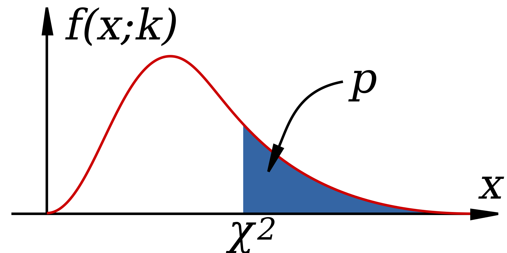

# Categorical variables and hypothesis testing

> Sometimes I'm right and I can be wrong\
> My own beliefs are in my song.\
> -- Sly and the Family Stone, *Everyday People*

In the last chapter of the book we learned the rudiments of probability theory and how to compute distributions of random variables, focusing on numeric variables. But many experiments in biology result in observations that naturally fall into a few categories (for example: sick or healthy patients, presence or absence of a mutation), and the resulting data sets are called *categorical*. Although it is possible, for instance, to denote mutants with the number 1 and wild type with 0, such designation does not add any value. Categorical variables require different tools for analysis than numerical ones; one cannot compute a linear regression between two categorical variables, because there is no meaningful way to place categories on axes. Instead, the data is presented by means of contingency tables containing counts of different categories.

To determine whether two categorical variables have a relationship, we need to use the machinery of *hypothesis testing*, which involves two steps: stating the hypothesis and then making the binary decision whether to reject it or not. Although such a binary approach is necessarily reductive, there are many situations that make it necessary: deciding whether to approve a drug or start a treatment, for example. Much of the scientific method is based on hypothesis testing: scientists formulate an idea (hypothesis), then accumulate data that can challenge it, and if the data contradict the hypothesis, they discard it (the hypothesis, not the data!) No hypothesis in science is ever proven in an absolute sense, which is why it is fundamentally different from mathematics. A hypothesis that has survived many tests and was found to be consistent with all available observations becomes a theory, like the theory of gravity or of evolution. But unlike a theorem, a scientific theory is not certain, and if solid evidence were to surface that contradicts Newton's gravitational theory, it would be falsified and thrown out (again, the theory, not the evidence.)

In this chapter we will describe the framework of hypothesis testing and apply it to the specific task of deciding whether two categorical variables are independent. After reading it you will know how to:


-   compute a categorical data table
-   compute a table of expected values based on independence
-   Explain the difference between the truth of the hypothesis and a test result
-   Describe four different outcomes of hypothesis testing
-   Compute different hypothesis testing error rates
-   Explain the meaning of p-value


## Contingency tables and independence

What kind of relationship can there be between categorical variables? It cannot be expressed in algebraic form, because without numeric values we cannot talk about a variable increasing or decreasing. Instead, the question is, does one variable being in a particular category have an effect on which category the second variable falls into? Let us say you want to know whether the age of the mother has an effect on the child having trisomy 21 (a.k.a. Down's syndrome), a genetic condition in which an embryo receives three chromosomes 21 instead of the normal two. The age of the mother is a numerical variable, but it can be classified into two categories: less than 35 and 35 or more years of age. The trisomy status of a fetus is clearly a binary, categorical variable: the fetus either has two chromosomes 21 or three.

The data are presented in a two-way or *contingency table*, which is a common way of presenting a data set with two categorical variables. The rows in such tables represent different categories of one variable and the columns represent the categories of the other, and the cells contain the data measurements of their overlaps. @tbl-DS-age is a contingency table for the data set on Down's syndrome and maternal age, in which the rows represent the two categories of maternal age and the columns represent the presence or absence of the syndrome. Each internal cell (as opposed to the total counts on the margins) corresponds to the number of measurement where both variables fall into the specified category, for instance the number of fetuses with the syndrome and a mother under 35 is 28.

| Maternal age | No DS  | DS  | Total  |
|-------------:|-------:|----:|-------:|
| \< 35        | 29,806 | 28  | 29,834 |
| \>= 35       | 8,135  | 64  | 8,199  |
| Total        | 37,941 | 92  | 38,033 |

: Contingency table for maternal age and incidence of Down's syndrome. Numbers represent counts of patients belonging to both categories in the row and the column. DS = Down's syndrome. From [@malone_first-trimester_2005]. {#tbl-DS-age}

Once the data are organized into a contingency table, we can address the main question stated above: does the age of the mother have an effect on whether a fetus inherits three chromosomes 21? Perhaps the first approach that suggests itself is to compare the fraction of mothers carrying a fetus with DS for the two age categories. In this case, the fraction for the under-35 category is $28/29834 \approx 0.00094$, while for the 35-and-over category the fraction is $64/8199 \approx 0.0078$. The two fractions are different by almost a factor of 10, which suggests a real difference between the two categories. However, all data contain an element of randomness and a pinch of error, thus there needs to be quantifiable way of deciding what constitutes a real effect. But to determine if there is a relationship, we first have to define what it means to not have one.

### independence of variables

The product rule enables us to extend the notion of independence from events to variables. The concepts of independence is the same in both contexts, since the probability of a value $x$ of a random variable $X$ corresponds to the probability of the event that gets mapped to $x$ by the variable. In order to make independence applicable to variables, the condition must hold true for all possible values of both random variables. That way, knowing the value of one variable has no effect on the probability of the other. In order to make it simpler to calculate, we will use the product rule as the equivalent condition for independence:

:::{#def-rv-indep}
Two random variables $X$ and $Y$ are *independent* if for all possible values of $X$ and $Y$ it is true that $$ P(X=a \land Y=b) = P(X=a)P(Y=b)$$
:::

This allows us to address the question posed at the beginning of the chapter: how can one determine whether a data set has independent variables? The definition allows us to calculate what we would expect if the variables were independent. Given a data set in the form of a contingency table, such as @tbl-DS-age, we can first calculate the probabilities of the two variables separately, and then from that predict the probabilities of the two variables together.

**Example.** Let us calculate the expected probabilities and frequencies of Down's syndrome in pregnant women in the two age categories. First, compute the probabilities of having Down's syndrome (and not having it), based on all the pregnancies in the data set: $P(DS) = 92/38033 \approx 0.0024$; the complementary probability is $P(no \ DS) = 1 - P(DS)$. Similarly, we can calculate the probability that a pregnant woman is 35 or over, based on the entire data set (let's denote this event $MA$ for mature age). $P(MA) = 8199/38033 \approx 0.216$; the complementary probability is $P(YA) = 1 - P(MA)$ ($YA$ stands for young age).

These separate probabilities were calculated from the data, and now we can use them to calculate the predicted probabilities of different outcome, based on the assumption of independence. The probability of a mature-age woman having a pregnancy with Down's syndrome, based on the product rule is $P(MA \land DS) \approx 0.0024 \times 0.216 = 0.000518$. Similarly, we can calculate the probabilities of the other three outcomes: $P(YA \land DS) \approx 0.0019$; $P(MA \land no \ DS) \approx 0.2156$; $P(YA \land no \ DS) \approx 0.782$.

These computed probabilities are based on the assumption that the two variables are independent. To compare the predictions with the data, we need to take one more step: convert the probabilities into counts, or frequencies of each occurrence. Since the probability is a fraction out of all outcomes, to generate the predicted frequency we need to multiply the probability by the total number of data points, in this case pregnant patients. The results of this calculation are seen in @tbl-DS-age-exp with *expected frequencies* shown instead of experimental observations.

| Maternal age | No DS  | DS    | Total  |
|-------------:|-------:|------:|-------:|
| \< 35        | 29,761.8 | 72.2 | 29,834 |
| \>= 35       | 8,179.2  | 19.8 | 8,199  |
| Total        | 37,941   | 92   | 38,033 |

: Expected frequencies of Down's syndrome for two different age groups of mothers, assuming that age and Down's syndrome are independent. {#tbl-DS-age-exp}

Notice that expected frequencies do not need to be integers, because they are the result of prediction and not a data measurement. Now that we have a prediction, we can compare it with the measurements in @tbl-DS-age. The numbers are substantially different, and we can see that the predicted frequency of Down's syndrome for women under 35 is larger than the frequencies for women at or above 35, due to the larger fraction of patients in the younger age group. We can calculate the differences between the *observed* and *expected* contingency tables to measure how much reality differs from the assumption of independence:

| Maternal age | No DS  | DS    | Total  |
|-------------:|-------:|------:|-------:|
| \< 35        | 44.2   | -44.2 | 29,834 |
| \>= 35       | -44.2  | 44.2  | 8,199  |
| Total        | 37,941 | 92    | 38,033 |

: Differences between the observed frequencies of Down's syndrome for different maternal ages and the expected frequencies based on the assumption of independence. {#tbl-DS-age-diff}

The table of differences shows that the observed frequency of DS in the data set are higher than expected by 44.2 for women above 35 years of age and is lower than expected by the same number for women below age 35. This demonstrates that mathematically speaking, the two variables of age and DS are not independent.

However, real data is messy and subject to randomness of various provenance. First, there is sampling error, which means that samples from two perfectly independent variables can and will differ from expected frequencies. Second, measurement errors or environmental noise can contribute more randomness to the data. Thus, simply checking that observed frequencies are different from expected is not enough to conclude that the variables are not independent. We need a method to decide what scale of differences is enough to declare that there is an effect e.g. of maternal age on the likelihood of DS. To do this, we leave the cozy theoretical confines of probability and venture into the wild and treacherous world of statistics.

### rejecting the null hypothesis

Hypothesis testing is one of the most important applications of statistics. People often think of statistics as a collection of tests to be used for different hypotheses, which is too simplistic, but different tests do occupy a large fraction of statistics books. In this book we will only dip a toe into hypothesis testing, and will primarily approach it in a probabilistic (model-centered) way rather than from a statistical (data-centered) viewpoint. Probability allows us to calculate the sensitivity and specificity of a test for a given null hypothesis, provided the hypothesis is simple enough and the data are sampled correctly.

**Example: testing whether a coin is fair.** Suppose we want to know whether a coin is fair (has equal probabilities of heads and tails) based on a data set of several coin tosses. How much evidence do we need in order to reject the hypothesis of a fair coin with a small chance of making a type I error? What is the corresponding chance of making a type II error, not detecting an unfair coin?

Let us first consider a data set of two coin tosses. If one is heads and one is tails, it's obvious we have no evidence to reject the null hypothesis. But what if both times the coin landed heads? The probability of this happening for a fair coin is 1/4, which means that if you reject the null hypothesis based on the evidence, your probability of committing a type I error is 1/4. However, it is very difficult to answer the second question about making a type II error, because in order to do the calculation we need to know something about the probability of heads or tails. The hypothesis being false only means that the probability is not 1/2, but it could be anything between 0 and 1.

Let us see how this test fares for a larger sample size. Suppose we toss a coin $n$ times, and if all $n$ come up heads, then we reject the hypothesis that the coin is fair. A fair coin will come up all heads with probability $1/2^n$, so that is the rate of false positives for this test. For example, if a coin came up heads ten times in a row, there is only a 1/1024 probability that this is the result of a fair coin, so the probability of making a type I error is less than 0.1%. Is this careful enough? This question cannot be answered mathematically - it depends on your sense of acceptable risk of making a mistake. Notice that if you decide to use a very stringent criteria for rejecting a null hypothesis, you will necessarily end up not rejecting more false hypotheses. Such is the face of us mortals, dealing with imperfect information in an uncertain world.

This leads us to an important new idea: the probability that a given data set is produced from the model of the null hypothesis is called the *p-value* of a test. In the example of coin tosses we just studied, the p-value was $p=1/2^n$. However, what if the data had 9 heads out of 10 tosses? The p-value then would be the probability of obtaining 9 or 10 heads out of 10. This is because to compute the probability of making a false positive error, we consider all cases that could have produced the result that is as different from expectation, or even further from expectation (in this case, 5 heads out of 10) than the data. [@whitlock_analysis_2008].

::: {#def-pvalue}
For a data set $D$ and a null hypothesis $H_0$, the *p-value* is defined as the probability of obtaining a result as far from expectation or farther than the data, given the null hypothesis.
:::

The p-value is the most used, misused, and even abused quantity is statistics, so please think carefully about its definition. One reason this notion is frequently misused is because it is very tempting to conclude that the p-value is the probability of the null hypothesis being true, based on the data. That is not true! The definition has the opposite direction of conditionality - we assume that the null hypothesis is true, and based on that calculate the probability of obtaining the data. There is no way (according to classical frequentist statistics) of assigning a probability to the truth of a hypothesis, because it is not the result of an experiment. The simplest way to describe the p-value is that it is the likelihood of the hypothesis, based on the data set. This means that the smaller the p-value, the less likely the hypothesis, and one can be more certain about rejecting the hypothesis. Alternatively, the p-value represents the probability of making a type 1 error, or rejecting the correct null hypothesis for a particular data set. These two notions may seem to be in conflict, but they tell the same story: if the hypothesis is likely, the probability of making a type 1 error is high.

## Chi-squared test

Now we are ready to address the question raised in the previous chapter of testing the independence hypothesis based on the table of observations and the calculated table of expected counts. In order to measure the difference between what is expected for a data table with two independent variables and the actual observations, we need to gather these differences into a single number. One can devise several ways of doing this, but the accepted measure is called the chi-squared statistic and it is defined as follows:

:::{#def-chisq}
The chi-squared value for the independence test is calculated on the basis of a two-way table with $m$ rows and $n$ columns as the sum of the differences between the observed counts and the computed expected counts as follows: 
$$\chi^2= \sum_i \frac{(Observed(i)-Expected(i))^2}{Expected(i)}$$ 
The number of degrees of freedom of chi-squared is $df = (m-1)(n-1)$.
:::

This number describes how far away the data is from what is expected for an independent data set. Therefore, the larger the chi squared statistic, the larger the differences between observed and expected frequency, and thus the null hypothesis of independence is less likely. However, simply obtaining the $\chi^2$ is not enough to say whether the two variables are independent. We need to translate the chi-squared value into the language of probability, that is to ask, what is the probability of obtaining a data set with a particular $\chi^2$ value, if those two variables were independent.

This question is answered using the *chi-squared probability distribution*, which describes the probability of the random variable $\chi^2$. Unlike the binomail and uniform distributions we saw in the previous chapter, it is a *continuous* distribution, because $\chi^2$ can take any (positive) real value. In another similarity, the $\chi^2$ distribution has an even more complicated functional form than the normal distribution, so I do not present it here, because it is not enlightening. I will also not share the derivation of the mathematical form of the distribution, as it is far outside the goals of this text. In practice, nobody computes either the chi-squared statistic or its probability distribution function by hand, instead computers handle these chores. The chi-squared distribution has one key parameter, called the number of degrees of freedom, which was defined above. Depending on d.f. the distribution changes, specifically for more degrees of freedom the distribution moves to the right, that is, the chi-squared values tend to be larger.

{#fig-chisq-dist}

The chi-squared distribution is used to determine the probability of obtaining a chi-squared statistic as at least as large as observed, based on the null hypothesis of independence. Figure @fig-chisq-dist shows a plot of the chi-squared distribution, as well as the total probability to the right of an observed $\chi^2$. This allows one to use it for the *chi-squared test* for independence between random variables, by comparing the p-value obtained from the distribution (by a computer) against a number called the *significance* level, which is decided by humans. The significance value $\alpha$ is a threshold that the test has to clear in order to reject the null hypothesis: if the p-value is less than $\alpha$, the independence hypothesis is rejected, otherwise it stands, although one can never say that the independence hypothesis is accepted.

There is no mathematical or statistical method for determining the appropriate significance level, it is entirely up to the users to decide how much risk of rejecting a true null hypothesis they are willing to tolerate. If you choose 0.01, that means you want the likelihood of the hypothesis to be less than 1% percent in order to reject it. This is entirely arbitrary, and using a rigid significance level to decide whether a hypothesis is true can lead to major problems which we will discuss in the next chapter.

Like all mathematical models, the chi-squared distribution relies on a set of assumptions. If the assumptions are violated, then the probability distribution does not apply and the p-value does not reflect the actual likelihood of the hypothesis. Here are the assumptions:

-   the data is from a simple random sample of the population
-   the sample size is sufficiently large
-   expected cell counts cannot be too small
-   the observations are independent of each other


### trisomy and pregnancy

Let us return to the data presented in @tbl-DS-age. We noted that the fraction of women in different age categories carrying fetuses with DS are different, but how certain are we that is not a fluke? To test the hypothesis of independence, we input the data into R and then run the chi-squared test:

```{r}
data <- matrix(c(29806, 8135, 28, 64),ncol=2,nrow=2)
test.output <- chisq.test(data)
print(test.output)
```

This tests of independence between the two variables of maternal age and DS status. The chi-squared parameter is about 122, reflecting the differences between expected and observed frequencies. This number us to calculate the p-value, which is very small (the number is actually caused by machine error). Therefore, the hypothesis can be rejected with a very small risk of making an error.

### stop-and-frisk and race

The practice of New York Police Department dubbed "stop-and-frisk" gave police officers to power to stop, question, and search people on the street without a warrant. Since the practice commenced in the early 2000s, it has generated controversy for several reasons. First, the 4th amendment to the U.S. Constitution limits the power of the state to detain and search citizens, by mandating that officials first obtain a warrant based on "probable cause," while based on the Supreme Court interpretation, police are allowed to stop someone without a warrant provided "the officer has a reasonable suspicion supported by articulable facts" that the person may be engaged in criminal activity. Exactly what these conditions mean and whether officers in NYPD always had reasonable suspicions before stopping is a legal matter, rather than a statistical one, and you can read federal judge Scheindlin's ruling here [@noauthor_stop-and-frisk_nodate].

The second issue raised by stop-and-frisk is whether it violates the principle of equal protection under the law enshrined in the 14th amendment of the Constitution. The idea that the law and its agents should treat people of different backgrounds the same, that people can be punished for their actions, but not for who they are, is deeply rooted in American law and culture. Critics of stop-and-frisk charge that officers disproportionately stop and search people of African-American and Hispanic background and therefore violate their constitutional rights to equal protection. As part of the trial, statistical evidence was introduced about the number of stops of New Yorkers of different racial backgrounds, how many of those stops resulted in the use of force, and how many uncovered evidence of criminal activity leading to an arrest. Let us analyze the data using our tools to address whether race and somebody being "stopped-and-frisked" are related.

The data in the summary of judge Scheindlin's decision is as follows: between 2004 to 2012, out of 4.4 million stops, 52% of the people stopped were black, 31% of the people stopped were Hispanic, and 10% of the people were white. The population of New York according to the 2010 census is approximately 23% black, 29% Hispanic, and 33% white. You may notice that the fractions are suggestive of a higher probability of stops of African-Americans, and lower probability of stops of white individuals, but we cannot use fractions to perform a chi-squared test, because actual counts are necessary to quantify the uncertainty in the testing.

Below I present data in the form of counts for only the calendar year 2011 [@noauthor_nypds_nodate], in the form of a contingency table with two variables: race/ethnicity and being stopped by police without a warrant. I used the census population of New York (http://factfinder2.census.gov) and its breakdown by race (white only, black only, Hispanic, other). The data are presented in table \ref{tab:stop_frisk_race}, and then are input in R and run through a chi-squared independence test.

```{r}
#| echo: false
data_mat <- matrix(c(61805, 2665172, 350743, 1527029, 223740, 
2119718, 49436, 1201578),ncol=4,nrow=2)
rownames(data_mat) <- c('stopped', 'not stopped')
colnames(data_mat) <- c('White','Black', 'Hispanic', 'Other')
print(data_mat)
test.output <- chisq.test(data_mat)
print(test.output)
```

The results confirm what comparing the percentages suggested: the race of a person in NYC is not independent of whether or not they get stopped and frisked, with only a tiny probability that this disparity could have happened by chance. However, this is only the beginning of the analysis that experts performed for the court trial. Drawing conclusions about motives from the data is tricky, since two variables may be related without a causal connection. Defenders of the practice have argued that the racial disparities reflect differences in criminal activity. The data, however, show that only 6% of the stops result in arrests, and 6% more in court summons, so the vast majority of those stopped and frisked were not engaged in criminal activity.


## Analysis of variance

ANOVA is a method for testing the hypothesis that there is no difference in means of subsets of measurements grouped by factors. Essentially, this is a generalization of linear regression to **categorical** explanatory variables instead of **numeric** variables, and it is based on very similar assumptions.

ANOVA perform at its best when we have a particular experimental design: a) we divide the population into groups of equal size (**balanced design**); b) we assign "treatments" to the subjects at random (**randomized design**); in case of multiple treatment combinations, we perform an experiment for each combination (**factorial design**); in most cases, we have a "null" treatment (e.g., placebo).

We speak of **one-way ANOVA** when there is a single axis of variation to our treatment (e.g., no intervention, option A, option B), **two-way ANOVA** when we apply two treatments for each group (e.g., no treatment, Ab, AB, aB), and so forth. Extensions include ANCOVA (ANalysis of COVAriance) and MANOVA (Multivariate ANalysis Of VAriance).

### ANOVA assumptions

ANOVA tests whether samples are taken from distributions with the same mean:

-   Null hypothesis: the means of the different groups are the same.
-   Alternative hypothesis: **At least one sample mean** is not equal to the others.

Let $Y$ indicate the response variable, and study the simplest case of one-way ANOVA. We have divided the samples in $k$ categories. Let us write an equation for each observation $Y_{ij}$ (the $j$th observation in group $i$):

$$
Y_{ij} = \mu_i + \epsilon_{ij}
$$

where $\mu_i$ is the mean of category $i$ and $\epsilon_{ij}$ are the deviations of each observation from the category mean, also called the residuals or noise.

We are making the same assumptions as for linear regression:

-   The observations are obtained independently (and randomly) from the population defined by the factor levels (groups)
-   The measurements for each factor level $i$ are independent
-   The residuals $\epsilon_{ij}$ are normally distributed for each factor level $i$
-   These normal distributions have the same variance

### Peforming one-way ANOVA

Just as with the chi-squared test, the basic idea of ANOVA is to compute a *test statistic* for a given data set, assuming that the null hypothesis is true, and then produce a p-value from the appropriate theoretical distribution. The computational details of ANOVA are a bit complicated, so I will give an outline of the main ideas.

Consider the question of whether the mean weight of a penguin in the Palmer penguins data set is independent of species. This can visualized as a boxplot:

```{r}
#| echo: false
library(palmerpenguins)
data(penguins)
boxplot(body_mass_g ~ species, data = penguins, ylab = 'body mass (g)', main = "Penguin mass for different species")
```

Each species has a different mean mass, but the question is, are they *significantly* different from each other? Statistically, if we collected different samples of penguins, are these differences likely to persist?

ANOVA answers this question by comparing the differences between the means against the noise within each category. Essentially, if the means differ by more than the spread within the categories, it is likely that they are significant.

We define two types of variance present in the data (of course, variance is at the heart of it): the variance of residuals within categories VR (the sum of squares of residuals divided by an appropriate normalization factor), and the variance of the means of the groups VM (the sum of squares differences of each mean from the global mean divided by the appropriate normalization factor).

If the null hypothesis were true, then we would expect the variance within groups VR and the variance of the means VR to be equal. This leads us to the ANOVA test statistic:

:::{#def-fstat}
The F-statistic is calculated as a ratio of the variance of the means $\mu_i$ of the categories (VM) and the variance of the errors (residuals) $\epsilon_{ij}$ within the categories (VR): 
$$ 
F = \frac{VM}{VR}
$$
:::

If the null hypothesis is true, this number is distributed according to the F-distribution; in other words, if we repeatedly sample from a population with equal means in each category, the F statistic would follow that distribution. This distribution (which I won't write down, but can be computed in R) allows us to calculate the p-value for any data set. A value of F greater than 1 means that the means have more variance than the residuals, and the p-value allows us to decide when that crosses a specific significance threshold.

## Hypothesis testing and errors {#sec-hyp-test-errors}

### positives and negatives

In the classic statistical framework, the hypothesis to be tested is usually called the *null hypothesis*, which helpfully rhymes with dull, because it represents the lack of anything interesting, essentially the default state of the system. In order to reject the null hypothesis, the data has to be substantially different from what is expected as default. For instance, medical tests have the null hypothesis that the patient is normal/healthy, and only if the results are substantially different from normal the patient is considered ill. Another common example is the criminal justice system: a defendant on trial undergoes a binary test where the null hypothesis is innocence. Only if the prosecutor's evidence is strong, that is, shows guilt beyond a reasonable doubt, that the null hypothesis is rejected and the defendant found guilty.

Tests are binary, in that there are only two possible decisions: to reject the hypothesis or to not reject it. We can never truly accept a hypothesis as true, due to the impossibility of perfect knowledge of the world. The decision to reject a hypothesis is called a *positive* test result, which seems backwards, but remember that the default or null hypothesis is a lack of anything unusual or interesting, so if the data are different from default, it is called a positive result. The decision to not reject the null hypothesis is called a *negative* test result. You are probably familiar with this in a medical context: if you've ever been tested for a disease, you know that a negative result is good news!

### types of errors

Hypothesis testing gives us a positive or negative result, but that does not mean that it is correct. Ideally, we want the test to reject a false null hypothesis, and not reject a true null hypothesis. These results are called, respectively, a *true positive* and a *true negative*. We can think of the hypothesis as a variable that can be either true or false, and of the test result as another variable than can be positive or negative. In the language of probability, the correct test results can be defined as follows:

::: {#def-true-results}
For a hypothesis that can be either false (F) or true (T) and a test result that can be either positive (P) or negative (N), the probabilities of a *true positive* and *true negative* are: 
$$ 
P(TP) = P(P \& F); \; P(TN) = P(N \& T)
$$
:::

However, hypothesis tests are not infallible, and they can make mistakes of two different types. A test that rejects a true null hypothesis makes a *type I error* or a *false positive* error, while a test that fails to reject a false null hypothesis makes a *type II error* or a false negative error. We can again define the probabilities of the two error types as the overlap of the events:

::: {#def-error-types}
For a hypothesis that can be either false (F) or true (T) and a test result that can be either positive (P) or negative (N), the two types of errors are: 
$$ 
P(FP) = P(P \& T); \; P(FN) = P(N \& F)
$$
:::

| Test result | $H_O = F$ | $H_O=T$ |
|-------------|-----------|---------|
| Positive    | TP        | FP      |
| Negative    | FN        | TN      |

: Table summarizing the four possible results of hypothesis testing, depending on the truth of null hypothesis $H_0$ and on the testing result.

### test quality measures

Now that we have classified the four outcomes of hypothesis testing, we can define the measures of quality of a given hypothesis test. This aims to address a practical concern: how much can you trust a test result? One may answer this question by testing on data where the hypothesis is known to be either true or false. For example, if there is a "gold standard" method for determining the presence or absence of disease, one can use that information to measure the quality of a new test. By performing enough tests, we can measure the frequencies of the four testing outcomes and then measure the following two quality metrics:

::: {#def-sens-spec}
The *sensitivity* (or power) of a test is the probability of obtaining a positive result, given a false hypothesis. 
$$ Sens = P(P | F) = \frac{P(TP)}{P(TP) + P(FN)} $$

The *specificity* of a test is the probability of obtaining the negative result, given a true hypothesis.
$$ Spec = P(N | T) = \frac{P(TN)}{P(TN) + P(FP)} $$
:::

Note that these are conditional probabilities, premised on knowing whether the hypothesis is actually true. On the other hand, there are two kinds of *error rates*:

::: {#def-hypo-errors}
The *type I error rate* or *false positive rate* is the probability of obtaining the positive result, given a true hypothesis (complementary to specificity): 
$$FPR = \frac{FP}{TN+FP}$$

The *type II error rate* or *false negative rate* is the probability of obtaining the negative result, given a false hypothesis (complementary to sensitivity). 
$$FNR = \frac{FN}{TP+FN}$$
:::

Notice that knowledge of sensitivity and specificity determine the type I and type II error rates of a test since they are complementary events. Of course, it is desirable for a test to be both very sensitive (reject false null hypotheses, detect disease, convict guilty defendants) and very specific (not reject true null hypotheses, correctly identify healthy patients, acquit innocent defendants), but that is impossible in practice. In fact, making a test highly sensitive (e.g. diagnose every patient with a disease) will make it useless because of it lack of specificity, and vice versa. In statistics, as in life, tradeoffs are required.

#### exercises

| Test for TB | TB absent | TB present |
|-------------|-----------|------------|
| Negative    | 1739      | 8          |
| Positive    | 51        | 22         |

: Data for TB testing using X-ray imaging {#tbl-TB-test}

@tbl-TB-test shows the results of using X-ray imaging as a diagnostic test for tuberculosis in patients with known TB status. Use it to answer the questions below.

1.  Calculate the marginal probabilities of the individual random variables, i.e. the probability of positive and negative X-ray test results, and of TB being present and absent.

2.  Find the probability of positive result given that TB is absent (false positive rate) and the probability of a negative result given that TB is absent (specificity).

3.  Find the probability of negative result given that TB is present (false negative rate) and the probability of a positive result given that TB is present (sensitivity).

4.  Find the probability that a person who tests positive actually has TB (probability of TB present given a positive result).

5.  Find the probability that a person who tests negative does not have TB (probability of no TB given a negative result).

6.  Assuming the test result and the TB status are independent, calculate the expected probability of both TB being present and a positive X-ray test.}

7.  Under the same assumption, calculate the expected probability of both TB being absent and a positive X-ray test.
