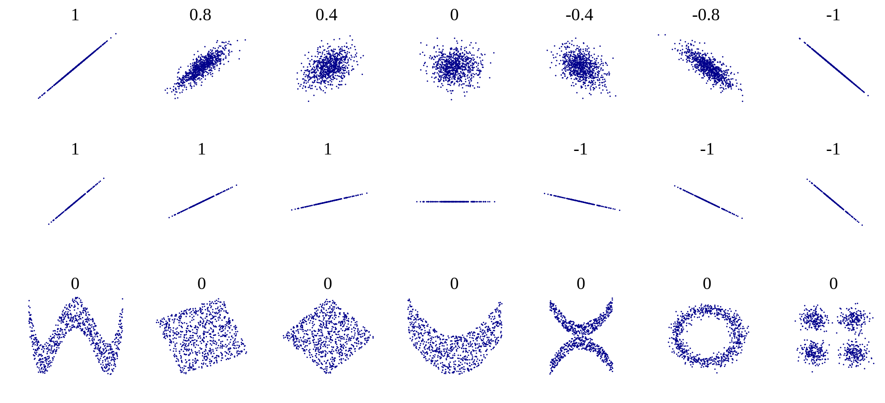

# Linear regression {#sec-linreg}

> The place in which I'll fit will not exist until I make it.\
> --James Baldwin

In the last two chapters we learned to use data sets which fall into a few categories. We now turn to data which can be measured as a range of numerical values. We can ask a similar question of numerical data that we asked of categorical: how can we tell whether two variables are related? And if they are, what kind of relationship is it? This takes us into the realm of *data fitting*, raising two related questions: what is the best mathematical relationship to describe a data set? and what is the quality of the fit? You will learn to do the following in this chapter:

- define the quality of the fit between a line and a two-variable data set
- calculate the parameters for the best-fit line based on statistics of the data set
- use R to calculate and plot best-fit line for a data set
- understand the meaning of correlation and covariance
- understand the phenomenon of regression to the mean

## Linear least-squares fitting {#lin-least-sq}

### sum of squared errors

It is easy to find the best-fit line for a data set with only two points: its slope and intercept can be found by solving the two simultaneous linear equations, e.g. if the data set consists of $(3,2.3), (6, 1.7)$, then finding the best fit values of $a$ and $b$ means solving the following two equations:

$$\begin{aligned}
3a + b &=& 2.3 \\
6a + b &=& 1.7
\end{aligned}$$

These equations have a unique solution for each unknown: $a=-0.2$ and $b=2.9$ (you can solve it using basic algebra).

However, a data set with two points is very small and cannot serve as a reasonable guide for finding a relationship between two variables. Let us add one more data point, to increase our sample size to three: $(3,2.3), (6, 1.7), (9, 1.3)$. How do you find the best fit slope and intercept? **Bad idea:** take two points and find a line, that is the slope and the intercept, that passes through the two. It should be clear why this is a bad idea: we are arbitrarily ignoring some of the data, while perfectly fitting two points. So how do we use all the data? Let us write down the equations that a line with slope $a$ and intercept $b$ have to satisfy in order to fit our data points:

$$\begin{aligned}
3a + b &=&  2.3 \\
6a + b &=& 1.7 \\
9a + b &=& 1.3
\end{aligned}$$

This system has no exact solution, since there are three equations and only two unknowns. We need to find $a$ and $b$ such that they are a *best fit* to the data, not the perfect solution. To do that, we need to define what we mean by the \index{fitting!goodness} *goodness of fit*.

One simple way to asses how close the fit is to the data is to subtract the predicted values of $y$ from the data, as follows: $e_i = y_i - (ax_i + b)$. The values $e_i$ are called the *errors* or \index{linear regression!residual} *residuals* of the linear fit. If the values predicted by the linear model ($ax_i+b$) are close to the actual data $y_i$, then the error will be small. However, if we add it all up, the errors with opposite signs will cancel each other, giving the impression of a good fit simply if the deviations are symmetric.

A more reasonable approach is to take absolute values of the deviations before adding them up. This is called the total deviation, for $n$ data points with a line fit:

$$ 
TD = \sum_{i=1}^n |  y_i - a x_i - b | $$

Mathematically, a better measure of total error is a sum of squared errors, which also has the advantage of adding up non-negative values, but is known as a better measure of the distance between the fit and the data (think of Euclidean distance, which is also a sum of squares) \index{fitting!least squares}:

$$ SSE = \sum_{i=1}^n (y_i -  a x_i - b)^2 $$

Thus we have formulated the goal of fitting the best line to a two-variable data set, also known as linear regression: **find the values of slope and intercept that result in the lowest possible sum of squared errors**. There is a mathematical recipe which produces these values, which will be described in the next section.

### best-fit slope and intercept

::: {#def-sample-cov}
The \index{covariance} *covariance* of a data set of pairs of values $(X,Y)$ is the sum of the products of the corresponding deviations from their respective means: $$ 
Cov(X,Y) = \frac{1}{n-1} \sum_{i=1}^n (x_i - \bar X) (y_i - \bar Y) $$
:::

Intuitively, this means that if two variable tend to deviate in the same direction from their respective means, they have a positive covariance, and if they tend to deviate in opposite directions from their means, they have a negative covariance. In the intermediate case, if sometimes they deviate together and other times they deviate in opposition, the covariance is small or zero. For instance, the covariance between two independent random variables is zero.

It should come as no surprise that the slope of the linear regression depends on the covariance, that is, the degree to which the two variables deviate together from their means. If the covariance is positive, then for larger values of $x$ the corresponding $y$ values tend to be larger, which means the slope of the line is positive. Conversely, if the covariance is negative, so is the slope of the line. And if the two variables are independent, the slope has to be close to zero. The actual formula for the \index{linear regression!slope}\index{slope!linear regression}slope of the linear regression is [@whitlock_analysis_2008]:

$$a = \frac{Cov(X,Y)}{Var(X)}$$

I will not provide a proof that this slope generates the minimal sum of squared errors, but that is indeed the case. To find the intercept of the linear regression, we make use of one other property of the best fit line: in order for it to minimize the SSE, it must pass through the point $(\bar X, \bar Y)$. Again, I will not prove this, but note that the point of the two mean values is the central point of the "cloud" of points in the scatter plot, and if the line missed that central point, the deviations will be larger. Assuming that is the case, we have the following equation for the line: $\bar Y = a\bar X + b$, which we can solve for the \index{linear regression!y-intercept} \index{y-intercept!linear regression} intercept $b$:

$$b = \bar Y - \frac{Cov(X,Y) \bar X}{Var(X)}$$

#### exercises

| X   | Y1  | Y2  | Y3  |
|-----|-----|-----|-----|
| 0   | 1   | 1   | 0.6 |
| 1   | 2   | 2   | 2.4 |
| 2   | 3   | 3   | 2.6 |
| 3   | 4   | 10  | 4.4 |

: Simple fake data sets for linear regression

Use the data sets in @tbl-ch4-linreg to answer the following questions (you may use a calculator or computer to help with arithmetic):

1.  Compute the means and standard deviations of each variable.

2.  Compute the covariance between X and each of the response variables (Y1, Y2, Y3).

3.  Calculate the slopes and intercepts of the linear regression for three pairs of variables (X as explanatory and Y1, Y2, Y3 as response variables).

4.  Make a scatter plot with X as explanatory and Y1 as response variable with a plot of the linear regression model. How good is the fit based on appearance?

5.  Make a scatter plot with X as explanatory and Y2 as response variable with a plot of the linear regression model. How good is the fit based on appearance? How different is the slope of this model compared to the slope for the model for Y1?

6.  Make a scatter plot with X as explanatory and Y3 as response variable with a plot of the linear regression model. How good is the fit based on appearance? How different is the slope of this model compared to the slope for the model for Y1?

### correlation and goodness of fit

The correlation between two random variables is a measure of how much variation in one corresponds to variation in the other. If this sounds very similar to the description of covariance, it's because they are closely related. Essentially, correlation is a normalized covariance, restricted to lie between -1 and 1. Here is the definition:

::: {#def-corr}
The (linear) *correlation* of a set of two paired variables (X,Y) is: $$r = \frac{Cov(X,Y)}{\sqrt{{Var(X)}{Var(Y)}}} =  \frac{Cov(X,Y)}{\sigma_X \sigma_Y}$$
:::

If the two variables are identical, $X=Y$, then the covariance becomes its variance $Cov(X,X) = Var(X)$ and the denominator also becomes the variance, and the correlation is 1. This is also true if $X$ and $Y$ are scalar multiples of each other, as you can see by plugging in $X= cY$ into the covariance formula. On the other extreme, if $X$ and $Y$ are negative multiples of each other, $X = -cY$, the pair is called *anti-correlated* and has the correlation coefficient of -1. All other cases fall in the middle, neither perfect correlation nor perfect anti-correlation. The special case if the two variables are *independent* (which we will properly define in the next chapter) their covariance is zero and the correlation coefficient is also zero.

{#fig-corr-examples}

This gives a connection between correlation and slope of linear regression:

$$a = r \frac{\sigma_Y}{\sigma_X}$$ {#eq-slope-corr}

Whenever linear regression is reported, one always sees the values of correlation $r$ and squared correlation $r^2$ displayed. The reason for this is that $r^2$ has a very clear meaning of the **the fraction of the variance of the dependent variable** $Y$ explained by the linear regression $Y=aX+b$. Let us unpack what this means.

According to the stated assumptions of linear regression, the response variable $Y$ is assumed to be linear relationship with the explanatory variable $X$, but with independent additive noise (also normally distributed, but it doesn't play a role for this argument). Linear regression captures the linear relationship, and the remaining error (residuals) represent the noise. Thus, each value of $Y$ can be written as $Y = R + \hat Y$ where $R$ is the residual (noise) and the value predicted by the linear regression is $\hat Y =aX+b$. The assumption that $R$ is independent of $Y$ means that $Var(Y) = Var (\hat Y) + Var (R)$ because variance is additive for independent random variables, as we will discuss in detail in chapter 5. By the same reasoning $Cov(X,\hat Y + R) = Cov(X,\hat Y) + Cov(X,R)$. These two covariances can be simplified further: $Cov(X,R) = 0$ because $R$ is independent random noise. $X$ and the predicted $\hat Y$ are perfectly correlated, so $Cov(X,\hat Y) = Cov(X,mX+b) = Var(X) = Var(\hat Y)$. This leads to the derivation of the meaning of $r^2$:

$$\begin{aligned}
  r^2 = \frac{Cov(X,Y)^2}{Var(X) Var(Y)} &=   \frac{(Cov(X,\hat Y) + Cov(X,R) )^2}{Var(X) Var(Y)}   = \\
  =\frac{Var(X)Var(\hat Y)}{Var(X) Var(Y)} &=  \frac{Var(\hat Y)}{Var(Y)}
\end{aligned}$$ {#eq-frac-var}

One should be cautious when interpreting results of a linear regression. First, just because there is no linear relationship does not mean that there is no other relationship. @fig-corr-examples shows some examples of scatter plots and their corresponding correlation coefficients. What it shows is that while a formless blob of a scatter plot will certainly have zero correlation, so will other scatter plots in which there is a definite relationship (e.g. a circle, or a X-shape). The point is that **correlation is always a measure of the strength of the linear relationship between variables.**

The second caution is well known, as that is the danger of equating correlation with a causal relationship. There are numerous examples of scientists misinterpreting a coincidental correlation as meaningful, or deeming two variables that have a common source as causing one another. For example, one can look at the increase in automobile ownership in the last century and the concurrent improvement in longevity and conclude that automobiles are good for human health. It is well-documented, however, that a sedentary lifestyle and automobile exhaust do not make a person healthy. Instead, increased prosperity has increased both the purchasing power of individuals and enabled advances in medicine that have increase our lifespans. To summarize, one must be careful when interpreting correlation: a weak one does not mean there is no relationship, and a strong one does not mean that one variable causes the changes in the other.

#### exercises

1.  Use the simple data sets in @tbl-ch4-linreg to calculate the correlation coefficients between X and Y1, Y2, and Y3, respectively. Which pair of variables has the highest correlation? Which has the lowest?
2.  Using the best-fit slope and intercept calculated in exercises in the previous section, calculate the predicted values of Y, Y1, and Y3, and compute the variance of the predicted values. What fraction of variance is explained by the linear regressions in each case, and how does it compare the correlation coefficient?

@fig-linreg-HRVO2 shows scatter plots of the rate of oxygen consumption (VO) and heart rate (HR) measured in macaroni penguins running on a treadmill (really).

```{r}
#| label: fig-linreg-HRVO2
#| echo: false
#| fig-cap: "Linear regression between mass-specific oxygen consumption and heart rate for two groups of Macaroni penguins"
#| fig-subcap: 
#|   - "Scatter plot and linear regression line" 
#|   - "Plot of residuals vs. predicted values" 
#| layout-ncol: 2
# plot the data and regression line
penguins <- read.csv("https://raw.githubusercontent.com/dkon1/quant_life_quarto/master/data/Macaroni_Penguins_Green.csv")
penguins_MF <- subset(penguins, Group == 'MF')
myfit <- lm(Mass.Specific.VO2 ~ Heart.Rate, data = penguins_MF)
plot(penguins_MF$Heart.Rate, penguins_MF$Mass.Specific.VO2, xlab = "heart rate (bpm)" , ylab = "oxygen consumption (mL/kg/min)", main= 'Penguins in group MF (molting females)')
abline(myfit)
penguins_BM <- subset(penguins, Group == 'BM')
myfit <- lm(Mass.Specific.VO2 ~ Heart.Rate, data = penguins_BM)
plot(penguins_BM$Heart.Rate, penguins_BM$Mass.Specific.VO2, xlab = "heart rate (bpm)" , ylab = "oxygen consumption (mL/kg/min)", main= 'Penguins in group BM (breeding males)')
abline(myfit)
```

| Group | $\bar {HR}$ | $\bar {VO_2}$ | sd(HR) | sd($VO_2$) | Cov(HR, $VO_2$) |
|-------|-------------|---------------|--------|------------|-----------------|
| MF    | 156.2       | 21.3          | 34.0   | 7.4        | 166.1           |
| BM    | 120.0       | 20.9          | 26.1   | 9.0        | 205.0           |

: Summary statistics (mean, standard deviation, and covariance) for the variables HR (heart rate) and mass-specific oxygen consumption ($VO_2$) for two groups Macaroni penguins.

3.  Find the dimensions and units of the slope and the intercept of the linear regression for this data (the units of heart rate and mass-specific oxygen consumption are on the plot).

4.  Based on the scatter plots, which data sets is closer to its line of best fit (has a higher goodness of fit), group MF or BM?

5.  The summary statistics for the variables in the two group of penguins are listed in @tbl-pen-summary. Compute the correlation coefficients between the two variables for both groups, and comment on how it relates to the goodness of fit you observed by eye.

6.  What fraction of the variance of the response variable is explained by the linear model for the BM group and for the FM group?

7.  Based on the statistics in @tbl-pen-summary, compute the best-fit slope and intercept for both groups of penguins based on these statistics, using the heart rate as the **explanatory** variable.

8.  Based on the statistics in @tbl-pen-summary, compute the best-fit slope and intercept for both groups of penguins based on these statistics, using the oxygen consumption as the **explanatory** variable. Why are the slopes not reciprocal to the ones computed in question 7?

## Residuals and assumptions of linear regression

### assumptions of regression

As noted in @sec-counting, all models begins with \index{linear regression!assumptions} assumptions, and linear regression is no exception. Although we have not stated it explicitly, the calculation of the slope and intercept for the best-fit line depends on several conditions being true, specifically: [@whitlock_analysis_2008]

- the variables have a linear relationship with random noise added

- there is no noise in the measurements of the explanatory variable

- the noise in the measurements of the response variable is normally distributed with zero mean and identical standard deviation

- the measurements are independent of each other

The reasons why these assumptions are necessary for linear regression to work are beyond the scope of the text, and they are elucidated very well in the book *Numerical Recipes* [@press_numerical_2007]. I will give a quick intuitive explanation for each one below without going into mathematical or statistical details.

If the first assumption is violated, you are trying to impose a linear relationship on something that is actually curvy. Some of the trend may be captured by the regression line, but you are leaving more signal behind in the residuals. In that case, it's best to use a nonlinear function for the fit, such as a polynomial, power law, or exponential.

The second assumption of no noise in the explanatory variable is a bit unrealistic, but the reason for it is that the measure of goodness of fit (squared residuals) is based only on the response variable, and there is no consideration of the noise in the explanatory variable. In practice, few variables can be measured without any error or noise, so this assumption is often ignored, but in practice it's a good idea to choose the variable with less noise as the explanatory variable (if such a choice is possible).

The third assumption of identically distributed, normal noise is due to the statistics of maximum-likelihood estimation of the slope and intercept, but some deviation from normality (bell-shaped distribution) of the noise, or slightly different variation in the noise is to be expected. In practice, if the residuals are clearly bimodal, or the noise is much larger for some part of the data than for others, then a different approach is needed, such as dividing the data set into two or more parts to model separately, or using a noise-adjusted linear regression.

The last assumption of independence is very important and often overlooked. The mathematical reasons for it have to do with properly measuring the goodness of fit, but intuitively it is because measurements that are linked can introduce a new relationship that has to do with the measurements, rather than the relationship between the variables. Violation of this assumption can seriously damage the reliability of the linear regression, but it is harder to detect than the other three.

Verifying these assumptions is not as simple as calculating a single test statistic, but it is still important to check that they are not obvisoulty violated, because otherwise the linear fit may be meaningless. In fact, the measure of the goodness of fit, $R^2$ is irrelevant if the assumptions are violated. There is a classic illustration of this through a generated data set called Anscombe's quartet, shown in @fig-anscombe, that was designed to produce the exact same linear regression line (with the slope of 3.0 and intercept of 0.5), with exactly the same r-squared (0.67). The human can see from the scatter plots that these variables have different relationships and different qualities of fit, so why does linear regression give identical results?

```{r}
#| label: fig-anscombe
#| echo: false
#| fig-cap: "4 Anscombe's data sets with identical linear regression parameters"
# plot the data and regression line
require(stats)
require(graphics)

##-- now some "magic" to do the 4 regressions in a loop:
ff <- y ~ x
mods <- setNames(as.list(1:4), paste0("lm", 1:4))
for(i in 1:4) {
  ff[2:3] <- lapply(paste0(c("y","x"), i), as.name)
  ## or   ff[[2]] <- as.name(paste0("y", i))
  ##      ff[[3]] <- as.name(paste0("x", i))
  mods[[i]] <- lmi <- lm(ff, data = anscombe)
 # print(summary(lmi))
}

## See how close they are (numerically!)
#sapply(mods, coef)
#lapply(mods, function(fm) coef(summary(fm)))

## Now, do what you should have done in the first place: PLOTS
op <- par(mfrow = c(2, 2), mar = 0.1+c(4,4,1,1), oma =  c(0, 0, 2, 0))
for(i in 1:4) {
  ff[2:3] <- lapply(paste0(c("y","x"), i), as.name)
  plot(ff, data = anscombe, col = "red", pch = 21, bg = "orange", cex = 1.2,
       xlim = c(3, 19), ylim = c(3, 13))
  abline(mods[[i]], col = "blue", lwd = 2)
}
#mtext("Anscombe's 4 Regression data sets", outer = TRUE, cex = 1.5)
#par(op)

```

The first data set (top left) is the only one for which linear regression is appropriate, because it is a linear trend with identically distributed noise added. Each of the other three data sets are not suited for linear regression for different reasons: the second one (top right) is clearly following a nonlinear (quadratic) trend; the third one (bottom left) has a perfect linear trend with only a single point strongly deviating from it; and the last one (bottom right) has all but one point concentrated at the same x coordinate, which makes the linear regression dependent on that single point.

### plotting the residuals

It's essential to verify that these assumptions are not (seriously) violated for any linear regression before putting trust in its results. The most straightforward way to do so is to plot the residuals (noise), which can help detect violations of at least two of the assumptions (the first and the third). The residuals are the differences between the predicted values of the response variable and the actual value from the data. As stated above, linear regression assumes that there is a linear relationship between the two variables, plus some uncorrelated noise added to the values of the response variable. If that were true, then the plot of the residuals would look like a formless blob, with a mean value of 0 and no discernible trend (e.g. no increase of residual for larger $x$ values). Visually assessing residual plots is an essential check on whether linear regression is a reasonable fit to the data in addition to the $R^2$ value.

To illustrate this, we show scatter plots of data and of residuals side by side. In @fig-linreg-kong the data set from [@kong_rate_2012-1] is plotted, showing the number of *de novo* mutations in 73 offspring as a function of paternal age. The data set is plotted in the first panel, with best-fit line overlayed on the data. The regression has the r-squared of 0.65, indicating a strong linear relationship between the variables. The residuals are plotted in the second panel, showing the errors as a function of predicted values of mutations. Despite a couple of apparent outliers, the residuals plot shows no trend either in the mean or the spread of the residuals, and thus the assumptions of regression are not violated.

```{r}
#| label: fig-linreg-kong
#| echo: false
#| fig-cap: "Linear regression between new mutations and paternal age"
#| fig-subcap: 
#|   - "Scatter plot and linear regression line" 
#|   - "Plot of residuals vs. predicted values" 
#| layout-ncol: 2
# plot the data and regression line
my_data<-read.table("https://raw.githubusercontent.com/dkon1/quant_life_quarto/master/data/kong_mutation_data.txt", header=TRUE)
myfit <- lm(Mutations ~ PatAge, my_data)

plot(my_data$PatAge, my_data$Mutations, xlab = "age (years)" , ylab = "new mutations")
abline(myfit)
# plot the residuals
plot(myfit$fitted.values, myfit$residuals, xlab = "predicted number of mutations" , ylab = "residuals")
abline(0,0)
```

In @fig-linreg-HRTemp shows a plot of heart rates as a function of body temperatures. The data set is plotted in the first panel, with best-fit line overlayed on the data. The regression has the r-squared of 0.06, indicating a weak linear relationship between the variables. The residuals are plotted in the second panel, showing the errors as a function of predicted values of heart rates. The residuals plot looks like a perfect blob, with no trend either in the mean or the spread of the residuals, and thus the assumptions of regression are not violated. Note that the strength of the linear relationship is completely separate from the analysis of residuals: a weak relationship like in this data set may have residuals perfectly compatible with linear regression, while a strong linear relationship may be computed for a data set which actually has a nonlinear trend and thus should be modeled with a different function.

```{r}
#| label: fig-linreg-HRTemp
#| echo: false
#| fig-cap: "Linear regression between heart rates and body temp"
#| fig-subcap: 
#|   - "Scatter plot and linear regression line" 
#|   - "Plot of residuals vs. predicted values" 
#| layout-ncol: 2
# plot the data and regression line
my_data<-read.table("https://raw.githubusercontent.com/dkon1/quant_life_quarto/main/data/HR_temp.txt", header=TRUE)
myfit <- lm(HR ~ Temp, my_data)
plot(my_data$Temp, my_data$HR, xlab = "body temperature (deg F)" , ylab = "heart rates (bpm)")
abline(myfit)
# plot the residuals
plot(myfit$fitted.values, myfit$residuals, xlab = "predicted HR (bpm)" , ylab = "residuals (bpm)")
abline(0,0)
```

#### exercises

For each of the residuals plotted below, state whether they indicate any violations of assumptions linear regression, and if so, explain which one is violated and how.

```{r}
#| label: fig-anscombe-resids
#| echo: false
#| fig-cap: "Four example residual plots"
#| fig-subcap: 
#|   - "Data set 1" 
#|   - "Data set 2"
#|   - "Data set 3"
#|   - "Data set 4" 
#| layout-ncol: 2
#| layout-nrow: 2
data("anscombe")
myfit <- lm(y4 ~ x4, data = anscombe)
plot(myfit$fitted.values, myfit$residuals, xlab = 'predicted values', ylab='residuals')
myfit <- lm(y2 ~ x2, data = anscombe)
plot(myfit$fitted.values, myfit$residuals, xlab = 'predicted values', ylab='residuals')
myfit <- lm(y1 ~ x1, data = anscombe)
plot(myfit$fitted.values, myfit$residuals, xlab = 'predicted values', ylab='residuals')
myfit <- lm(y3 ~ x3, data = anscombe)
plot(myfit$fitted.values, myfit$residuals, xlab = 'predicted values', ylab='residuals')
```

## Regression to the mean {#sec-reg-to-mean}

The phenomenon called \index{regression to the mean} regression to the mean is initially surprising. Francis Galton first discovered this by comparing the heights of parents and their offspring. He collected a classic data set of the heights of parents and their children, and examined their relationship (this was before scatter plots were used, so he looked at summary tables). It was clear that there was a positive relationship between these variables, that is, taller parents tend to have taller children, as you can see in @fig-linreg-Galton. One can make a linear regression both to predict the children's height from the parents', and the other way around. @fig-linreg-Galton shows Galton's data set along with the linear regression line and the identity like ($y=x$). If each child had exactly the same height as the parents, the scatter plot would lie on the identity line. Instead, the linear regression lines have slope less than 1 for both the plot with the parental heights as the explanatory variable and for the plot with the variables reversed. To make sure that linear regression is appropriate, we plot the residuals of both models in @fig-linreg-Galton-resid. They show no trend or pattern, so we can trust that the linear relationship is reasonable.

However, the Galton went further: he took a subset of parents who are taller than average and observed that their children were, on average, shorter than their parents. He also compared the heights of parents who are shorter than average, and found that their children were on average taller than their parents. This suggests the conclusion that in long run everyone will converge closer to the average height - hence "regression to mediocrity", as Galton called it [@senn_francis_2011].

```{r}
#| label: fig-linreg-Galton
#| echo: false
#| fig-cap: "Galton data on heights of parents and of children as scatter plots. The dotted red lines show the identity line y=x and the solid black line is the linear regression."
#| fig-subcap: 
#|   - "Child height (response variable) vs parent height (explanatory variable)" 
#|   - "Parent height (response variable) vs child height (explanatory variable)" 
#| layout-ncol: 2

library("HistData")
myfit <- lm(child ~ parent, Galton) 
plot(Galton$parent, Galton$child, xlab='mid-parent height (inches)', ylab='child height (inches)',cex=1.5, cex.axis=1.5,cex.lab=1.5)
abline(myfit,lwd=3,lty=1)
abline(0,1,lwd=3,lty=2,col='red')
myfit <- lm(parent ~child, Galton) 
plot(Galton$child, Galton$parent, xlab='child height (inches)', ylab='mid-parent height (inches)',cex=1.5, cex.axis=1.5,cex.lab=1.5)
abline(myfit,lwd=3)
abline(0,1,lwd=3,lty=2,col='red')
```

```{r}
#| label: fig-linreg-Galton-resid
#| echo: false
#| fig-cap: "Residuals of the two regression lines in the Galton data set"
#| fig-subcap: 
#|   - "Residuals of child height" 
#|   - "Residuals of parent height" 
#| layout-ncol: 2
myfit <- lm(child ~ parent, Galton) 
plot(myfit$fitted.values, myfit$residuals, xlab='predicted child height (inches)', ylab='residuals (inches)',cex=1.5, cex.axis=1.5,cex.lab=1.5)
abline(0,0,lwd=3,lty=1)
myfit <- lm(parent ~child, Galton) 
plot(myfit$fitted.values, myfit$residuals, xlab='predicted mid-parent height (inches)', ylab='residuals (inches)',cex=1.5, cex.axis=1.5,cex.lab=1.5)
abline(0,0,lwd=3,lty=2)
```

The conclusion that over generations, offspring tend to have less spread than the parents is not correct: the parents and children in Galton's experiment had a very similar mean and standard deviation. This appears to be a paradox, but it is easily explained using linear regression. Consider two identically distributed random variables $(X,Y)$ with a positive correlation $r$. The slope of the linear regression is $a = r \sigma_Y/\sigma_X$ and since $\sigma_Y=\sigma_X$, the slope is simply $r$. Select a subset with values of $X$ higher than $\bar X$, and consider the mean value of $Y$ for that subset. If the slope $a<1$ (the correlation is not perfect), then the mean value of $Y$ for that subset is less than the mean value of $X$. Similarly, for a subset with values of $X$ lower than $\bar X$, the mean value of $Y$ for that subset is greater than the mean value of $X$, again as long as the slope is less than 1.The children's heights have a higher standard deviation, which is likely an artifact of the experiment. In the data set the heights of the two parents were averaged to take them both into account, which substantially reduces the spread between male and female heights. To summarize, although the children of taller parents are shorter on average than their parents, and the children of shorter parents are taller than their parents, the overall standard deviation does not decrease from generation to generation.

### Discussion questions

Please read the paper on measuring the rate of \index{sequencing!whole genome} de novo mutations in humans and its relationship to paternal age [@kong_rate_2012-1].

1.  What types of mutations were observed in the data set? What were the most and the least common?

2.  The paper shows that both maternal and paternal age are positively correlated with offspring inheriting new mutations. What biological mechanism explains why paternal age is the dominant factor? What could explain the substantial correlation with maternal age?

3.  Is linear regression the best representation of the relationship between paternal age and number of mutations? What other model did the authors use to fit the data, and how did it perform?

4.  What do you make of the historical data of paternal ages the authors present at the end of the paper? Can you postulate a testable hypothesis based on this observation?

## Demonstration of regression to the mean

The following interactive simulation allows you to explore the effect of regression to the mean on randomly simulated data.

```{shinylive-r}
#| standalone: true
#| viewerHeight: 650

library(shiny)
library(bslib)
library(ggplot2)


# =============================================================================
# Regression to the mean, illustrated with generated data
#
# Heart rate 1 (HR1) ~ Normal(mean = 70, sd = 10), n = 1000.
# Heart rate 2 (HR2) = r * HR1 + c + noise,  noise ~ Normal(0, s),
#   where the constant c = 70 * (1 - r) is added so that HR2 has the same mean
#   as HR1 (equivalently, HR2 = 70 + r * (HR1 - 70) + noise).
#
# Sliders set r and s. The app shows a scatterplot with the least-squares line
# (slope and intercept displayed) and prints the mean of HR1 and HR2 for the
# people whose HR1 is below the overall HR1 mean, and again for those above it.
#
# Regression to the mean: a subgroup selected as extreme on HR1 is, on average,
# less extreme on HR2 (relative to each variable's own mean and spread) whenever
# the two are less than perfectly correlated.
#
# To run:
#   install.packages(c("shiny", "ggplot2"))
#   shiny::runApp("regression_to_mean_app.R")
# =============================================================================

# Fixed HR1 and unit noise so moving the sliders rescales the SAME data smoothly
gen_data <- function(r, s, seed, n = 1000) {
  set.seed(seed)
  HR1 <- rnorm(n, mean = 70, sd = 10)
  z   <- rnorm(n, mean = 0, sd = 1)
  HR2_raw <- r * HR1 + s * z
  # Constant (y-intercept) that gives HR2 the same mean as HR1.
  # Its expected value is 70 * (1 - r); computed from the sample so the
  # realized means are exactly equal.
  const <- mean(HR1) - mean(HR2_raw)
  df <- data.frame(HR1 = HR1, HR2 = HR2_raw + const)
  attr(df, "const") <- const
  df
}

plot_rtm <- function(df) {
  m1 <- mean(df$HR1); m2 <- mean(df$HR2)
  fit <- lm(HR2 ~ HR1, data = df)
  b0 <- coef(fit)[1]; b1 <- coef(fit)[2]
  rho <- cor(df$HR1, df$HR2)
  
  ggplot(df, aes(HR1, HR2)) +
    geom_point(alpha = 0.22, colour = "#3a76c2", size = 1.3) +
    geom_vline(xintercept = m1, linetype = "dashed", colour = "grey55") +
    geom_hline(yintercept = m2, linetype = "dashed", colour = "grey55") +
    geom_smooth(method = "lm", formula = y ~ x, se = FALSE,
                colour = "#c0392b", linewidth = 1.1) +
    annotate("label", x = min(df$HR1), y = max(df$HR2), hjust = 0, vjust = 1,
             size = 4.2, label.size = 0, fill = "#ffffff", alpha = 0.7,
             label = sprintf("HR2 = %.2f + %.3f x HR1\ncorrelation = %.3f",
                             b0, b1, rho)) +
    labs(x = "Heart rate 1 (bpm)", y = "Heart rate 2 (bpm)",
         subtitle = "Dashed lines mark the mean of each variable") +
    theme_bw(base_size = 13) +
    theme(panel.grid.minor = element_blank())
}

# ---- UI --------------------------------------------------------------------
ui <- fluidPage(
  tags$head(tags$style(HTML("
    body { font-family: 'Segoe UI', Roboto, Helvetica, Arial, sans-serif; }
    pre { font-size: 14px; background:#fafafa; border:1px solid #e3e3e3;
      border-radius:8px; padding:12px 14px; }
    .note { background:#eef4fb; border-left:4px solid #3a76c2;
      padding:10px 14px; border-radius:6px; font-size:14px; }
  "))),
  
  titlePanel("Regression to the mean"),
  
  sidebarLayout(
    sidebarPanel(
      width = 3,
      sliderInput("r", "r  (HR1 multiplier)",
                  min = 0, max = 1.5, value = 0.8, step = 0.05),
      sliderInput("s", "s  (noise standard deviation, bpm)",
                  min = 0, max = 30, value = 8, step = 0.5),
      actionButton("regen", "Regenerate data", class = "btn-sm"),
      helpText("HR1 ~ Normal(70, 10), n = 1000. ",
               "HR2 = r x HR1 + c + Normal(0, s), where c = 70 x (1 - r) is ",
               "added so HR1 and HR2 share the same mean. The regression slope ",
               "is close to r; with any noise the correlation is below 1, which ",
               "is what produces regression to the mean.")
    ),
    
    mainPanel(
      width = 9,
      plotOutput("scatter", height = "420px"),
      tags$br(),
      h4("Group means (split at the overall HR1 mean)"),
      verbatimTextOutput("means"),
      uiOutput("interp")
    )
  )
)

# ---- Server ----------------------------------------------------------------
server <- function(input, output, session) {
  
  seed <- reactiveVal(2024)
  observeEvent(input$regen, seed(seed() + 1))
  
  df <- reactive(gen_data(input$r, input$s, seed()))
  
  stats <- reactive({
    d <- df()
    m1 <- mean(d$HR1); m2 <- mean(d$HR2)
    sd1 <- sd(d$HR1);  sd2 <- sd(d$HR2)
    below <- d$HR1 < m1
    list(
      n = nrow(d), m1 = m1, m2 = m2, sd1 = sd1, sd2 = sd2,
      const = attr(d, "const"),
      n_lo = sum(below), n_hi = sum(!below),
      lo1 = mean(d$HR1[below]),  lo2 = mean(d$HR2[below]),
      hi1 = mean(d$HR1[!below]), hi2 = mean(d$HR2[!below])
    )
  })
  
  output$scatter <- renderPlot(plot_rtm(df()))
  
  output$means <- renderPrint({
    s <- stats()
    cat(sprintf("Constant c added to HR2 (y-intercept) = %5.2f   [ = 70 x (1 - r) ]\n\n",
                s$const))
    cat(sprintf("Overall (n = %d):        mean HR1 = %5.2f    mean HR2 = %5.2f\n",
                s$n, s$m1, s$m2))
    cat(strrep("-", 62), "\n")
    cat(sprintf("HR1 below mean (n = %3d): mean HR1 = %5.2f    mean HR2 = %5.2f\n",
                s$n_lo, s$lo1, s$lo2))
    cat(sprintf("HR1 above mean (n = %3d): mean HR1 = %5.2f    mean HR2 = %5.2f\n",
                s$n_hi, s$hi1, s$hi2))
  })
  
  output$interp <- renderUI({
    s <- stats()
    lo1z <- (s$lo1 - s$m1) / s$sd1; lo2z <- (s$lo2 - s$m2) / s$sd2
    hi1z <- (s$hi1 - s$m1) / s$sd1; hi2z <- (s$hi2 - s$m2) / s$sd2
    rtm  <- abs(lo2z) < abs(lo1z) && abs(hi2z) < abs(hi1z)
    
    verdict <- if (rtm)
      "Each extreme group is nearer the mean on HR2 than on HR1 &mdash; regression to the mean."
    else
      "HR2 is not less extreme than HR1 here; try adding noise or setting r &lt; 1."
    
    div(class = "note",
        HTML(sprintf(
          "HR1 and HR2 now share a mean of about %.1f bpm, so the group means ",
          s$m1),
          sprintf("compare directly. The below-average group averages %.1f on HR1 ",
                  s$lo1),
          sprintf("but %.1f on HR2; the above-average group averages %.1f on HR1 ",
                  s$lo2, s$hi1),
          sprintf("but %.1f on HR2. %s", s$hi2, verdict)))
  })
}

shinyApp(ui, server)

```
